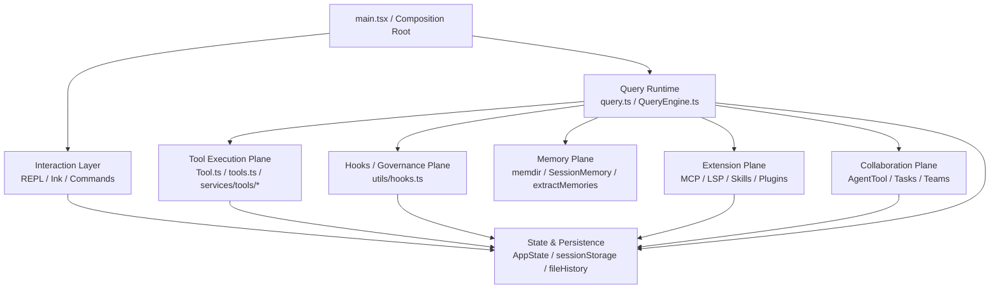

# Claude Code Build 架构深度分析

分析对象：`chenqinggang001/claude-code-build`

这份分析以源码仓为基础，目标是从两个粒度建立完整理解：

- **大粒度**：系统边界、启动链路、运行时主线、工具/命令/扩展/状态/多代理协作的整体结构
- **小粒度**：关键模块内部的层次划分、代表文件、关键逻辑与调用关系

仓库本身是一个大型终端原生 agent 系统，包含：

- 启动与装配入口
- Query / Session Runtime
- Tool Execution Plane
- Hooks / Governance Plane
- Skills / Plugins / MCP / LSP 扩展层
- Agent / Task / Team 协作层
- State / Persistence / Session Storage 底座
- Terminal UI / Ink 交互层
- Memory / Session Memory / Extract Memories 机制

---

## 阅读顺序

### 0. 单篇总图版（推荐先看）
- [`docs/00-architecture-all-in-one.md`](docs/00-architecture-all-in-one.md)

### 1. 全局结构
- [`docs/01-system-overview.md`](docs/01-system-overview.md)
- [`docs/02-startup-and-composition-root.md`](docs/02-startup-and-composition-root.md)
- [`docs/03-directory-map-and-module-boundaries.md`](docs/03-directory-map-and-module-boundaries.md)

### 2. 运行时主线
- [`docs/04-query-runtime-and-main-loop.md`](docs/04-query-runtime-and-main-loop.md)
- [`docs/05-tools-commands-hooks-architecture.md`](docs/05-tools-commands-hooks-architecture.md)

### 3. 核心专题
- [`docs/06-memory-architecture.md`](docs/06-memory-architecture.md)
- [`docs/07-mcp-lsp-skills-plugins.md`](docs/07-mcp-lsp-skills-plugins.md)
- [`docs/08-agent-task-team-architecture.md`](docs/08-agent-task-team-architecture.md)
- [`docs/09-state-session-storage-and-persistence.md`](docs/09-state-session-storage-and-persistence.md)

### 4. 文件与符号索引
- [`docs/10-key-files-and-entrypoints.md`](docs/10-key-files-and-entrypoints.md)
- [`docs/generated/directory-counts.md`](docs/generated/directory-counts.md)
- [`docs/generated/root-files.md`](docs/generated/root-files.md)
- [`docs/generated/key-file-symbols.md`](docs/generated/key-file-symbols.md)

---

## 本分析回答的问题

1. `main.tsx` 如何完成启动装配
2. `query.ts` / `QueryEngine.ts` 如何组织主循环
3. Tool / Command / Hook 三条控制路径如何协作
4. Memory 模块由哪些层组成，分别承担什么职责
5. MCP / LSP / Skills / Plugins 在系统中的关系是什么
6. Agent / Task / Team 如何构成多代理协作层
7. State / Session Storage 如何支撑长会话与恢复
8. 从目录、文件、函数三个层面，哪些入口最值得优先阅读

---

## 架构摘要

---

## 仓库规模

自动统计结果见：
- [`docs/generated/directory-counts.md`](docs/generated/directory-counts.md)

当前仓库 `src/` 文件规模很大，核心目录包括：

- `utils/`
- `components/`
- `commands/`
- `tools/`
- `services/`
- `hooks/`
- `ink/`
- `state/`
- `query/`
- `memdir/`

这说明该仓不是单纯的工具集合，而是一套完整的、长期演进的 agent runtime 与终端产品。
