# Claude Code Build 架构总图版（单篇串讲）

> 目标：**一篇看完整体**。少讲废话，多用 Mermaid，把这个仓从全局到细节串起来。

---

## 1. 一眼看全局：这是个什么系统？

结论先放前面：这不是“一个会调模型的 CLI”，而是一套**终端原生的 Agent Runtime 平台**。

它的主干不是 UI，也不是单个工具，而是围绕 **Query Runtime** 展开的多个平面：

- 启动与装配
- 会话主循环
- Tool Execution Plane
- Hook / Governance Plane
- Memory Plane
- Extension Plane
- Collaboration Plane
- State / Persistence Plane
- Terminal UI / Interaction Layer

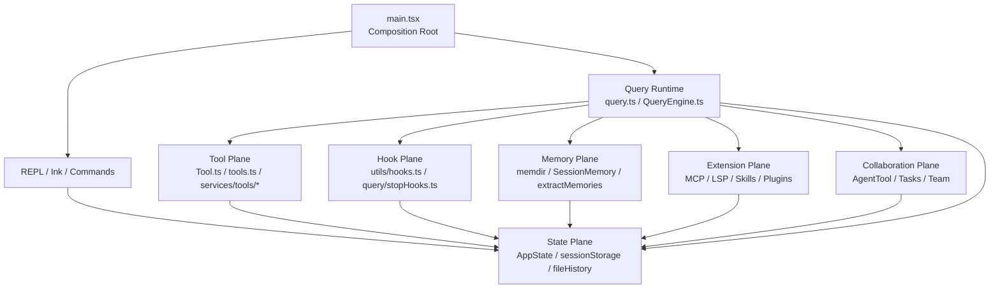

**核心判断：**
- `main.tsx` 负责装配
- `query.ts / QueryEngine.ts` 负责总控
- `Tool Plane` 负责执行
- `Hook Plane` 负责治理
- `State Plane` 负责共享事实与恢复

---

## 2. 全系统主线：从启动到结束到底发生了什么

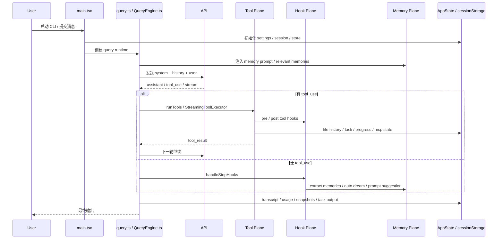

**一句话概括：**
这个系统的“主函数”其实不是单个函数，而是一个**带 stop 阶段、带工具回路、带记忆与后台动作的 query state machine**。

---

## 3. 启动装配：`main.tsx` 干的不是业务，是接总电源

`main.tsx` 的作用不是“实现功能”，而是把所有子系统装起来。

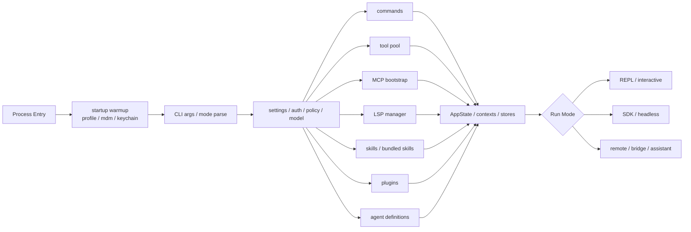

**核心结论：**
- `main.tsx` 是 **Composition Root**
- 它决定运行模式、初始化扩展系统、准备共享状态
- 真正的运行时控制权随后交给 `query.ts` / `QueryEngine.ts`

---

## 4. Query Runtime：整个仓的心脏

这个仓最核心的不是工具，而是 **主循环**。

### 两条入口
- 交互路径：`query.ts`
- Headless / SDK 路径：`QueryEngine.ts`

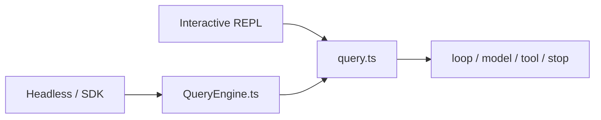

### Query 主循环最核心的状态
- `messages`
- `toolUseContext`
- `turnCount`
- `transition`
- `autoCompactTracking`
- `stopHookActive`
- `pendingToolUseSummary`
- `maxOutputTokensRecoveryCount`

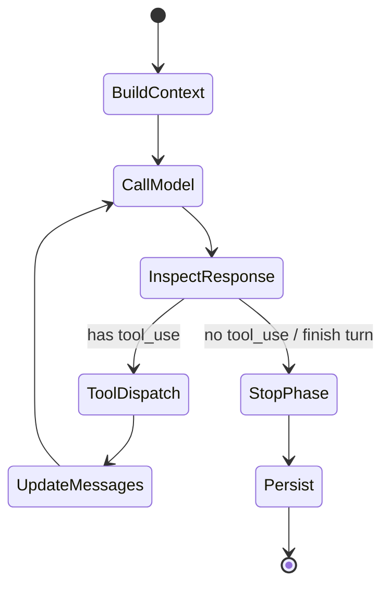

**核心结论：**
- 这是个**回合状态机**，不是一次性请求函数
- 工具调用、stop hooks、压缩、恢复都是主循环内建语义

### 4.1 长上下文治理：auto compact / reactive compact / context collapse / snip

Query Runtime 里还有一条很重要但容易被忽略的支线：**上下文溢出治理**。

这几套机制不是重复的，而是处在不同阶段：
- `snipCompact`：先做轻量裁剪
- `autoCompact`：达到阈值前置压缩
- `contextCollapse`：更强的上下文折叠与 overflow 恢复
- `reactiveCompact`：在真正遇到 413 / prompt-too-long 后补救

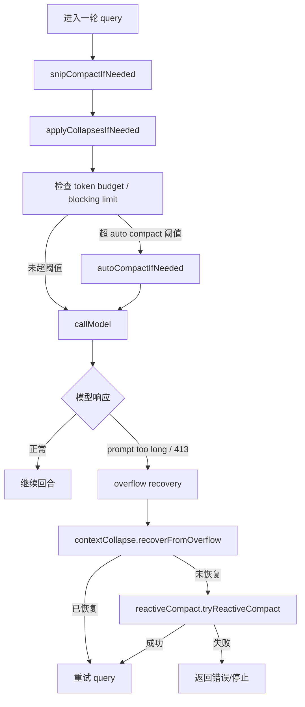

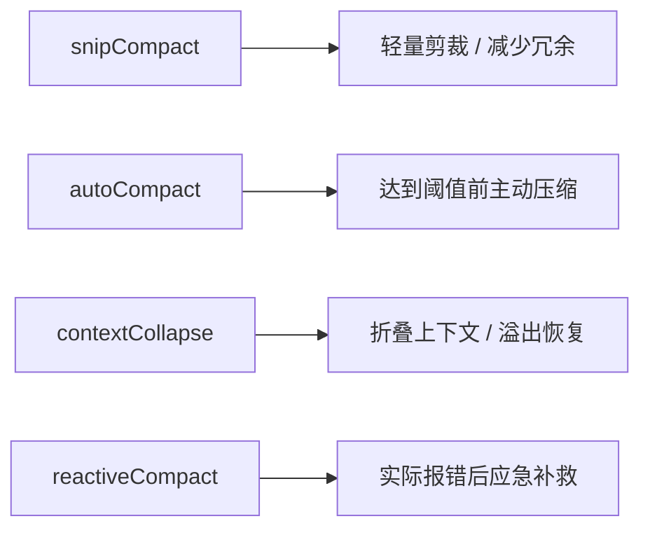

**这一块的核心价值不是“压缩一次对话”那么简单，而是：**
- 保持主循环可继续
- 避免长上下文直接卡死
- 让 proactive 与 reactive 两套恢复路径并存
- 为长会话 / agentic 场景提供真正可运行的上下文治理能力

---

## 5. Tool Plane：系统“能做什么”

Tool Plane 由四层组成：

1. `Tool.ts`：工具协议
2. `tools.ts`：工具池装配
3. `services/tools/*`：工具执行与调度语义
4. `tools/*`：具体工具实现

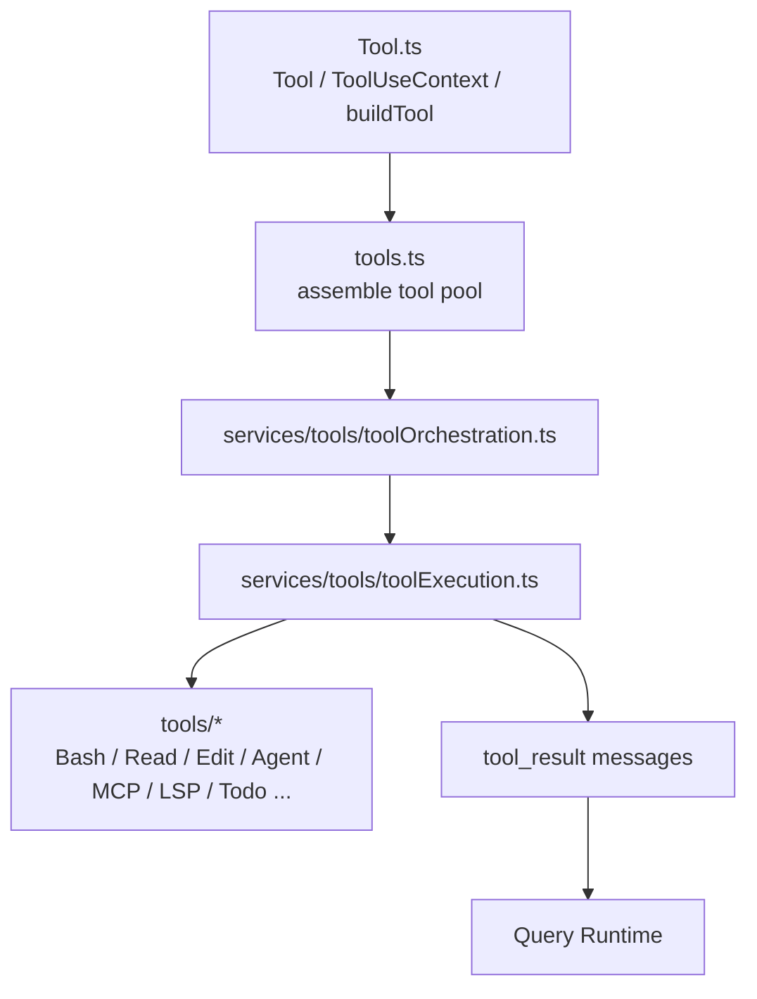

### Tool 批调度语义
不是一股脑全跑，而是先分：
- 并发安全工具
- 非并发安全工具

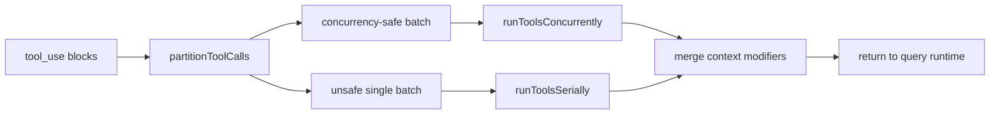

**核心结论：**
- Tool Plane 不只是“执行工具”
- 它还负责并发边界、context modifier、生存期状态、进度上报

### 5.1 StreamingToolExecutor：流式工具执行

这一层还有一个很关键的优化点：**不是等 assistant 整轮输出结束后再统一执行工具，而是当流式响应里某个 `tool_use block` 已经成型时，就立刻开始执行。**

对应文件：
- `services/tools/StreamingToolExecutor.ts`
- `query/config.ts` 中的 `streamingToolExecution` gate

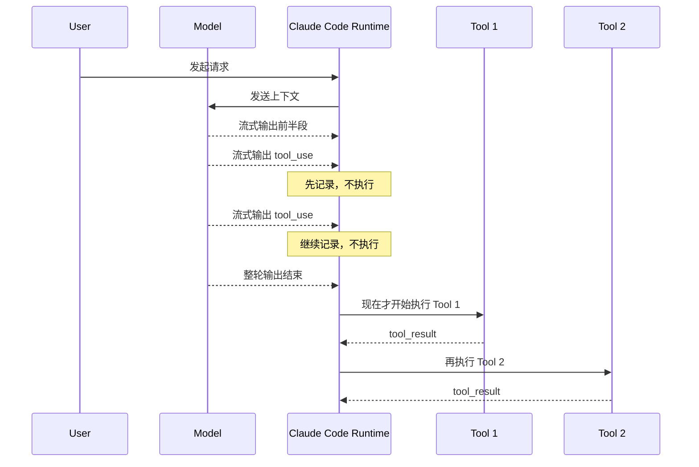

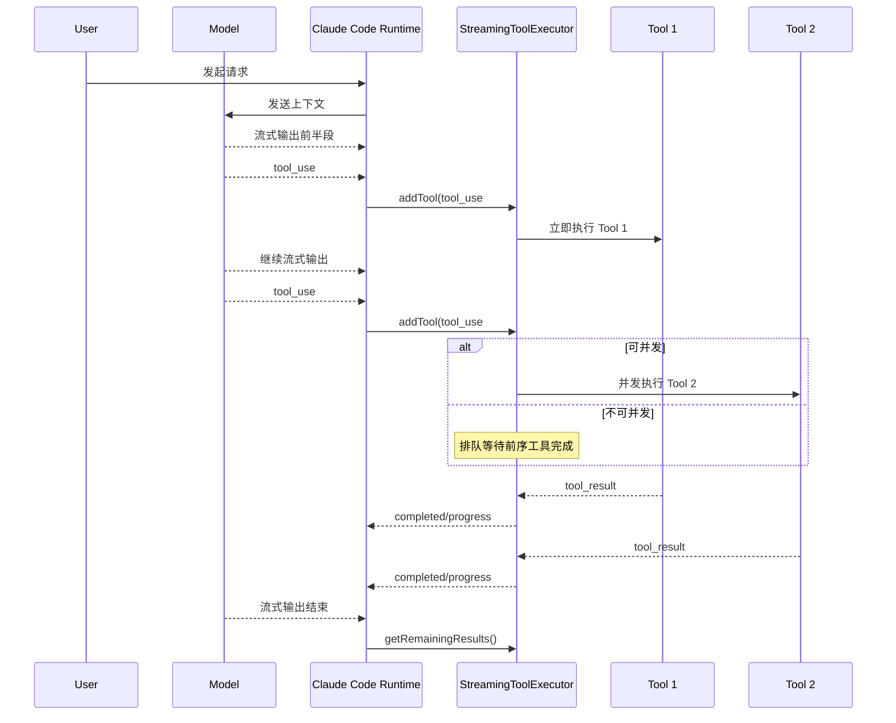

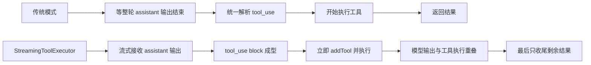

**它提升的不是单个工具速度，而是端到端时延：**
- 首个工具更早启动
- 多工具链更容易流水化
- 用户更早看到进度
- 在慢工具 / 多工具 / 长流式输出场景更有价值

**它带来的复杂度也更高：**
- 结果顺序控制
- 并发安全判定
- 中断传播
- fallback 后丢弃旧流结果
- progress / completed result 的混合回流

---

## 6. Commands、Tools、Hooks 三条线别混

这仓里非常容易看乱的一点，就是把 command、tool、hook 混成一锅。

实际上它们是三条不同控制路径：

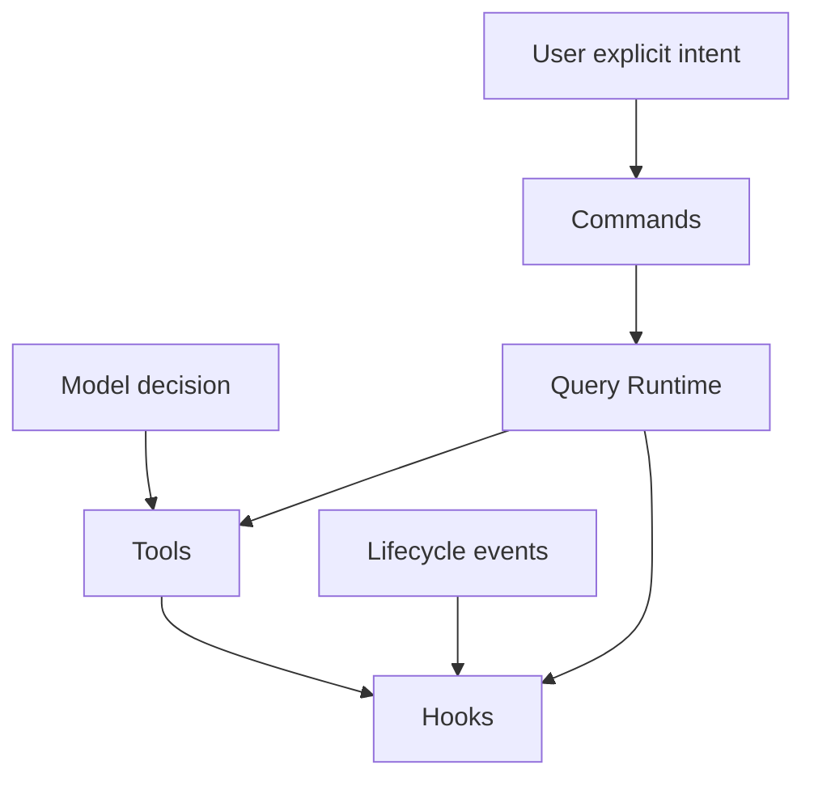

### 它们分别是什么
- **Commands**：用户显式控制面
- **Tools**：模型可调用执行能力
- **Hooks**：生命周期治理平面

### 代表文件
- Commands：`commands.ts`, `commands/*`
- Tools：`Tool.ts`, `tools.ts`, `services/tools/*`, `tools/*`
- Hooks：`utils/hooks.ts`, `utils/hooks/*`, `query/stopHooks.ts`

**核心结论：**
- Command 不是 Tool
- Hook 不是 Tool
- Hook 是治理层，不是业务层

---

## 7. Hook Plane：系统怎么被“管住”

Hook Plane 最大的价值，是把系统从“会执行”变成“可治理”。

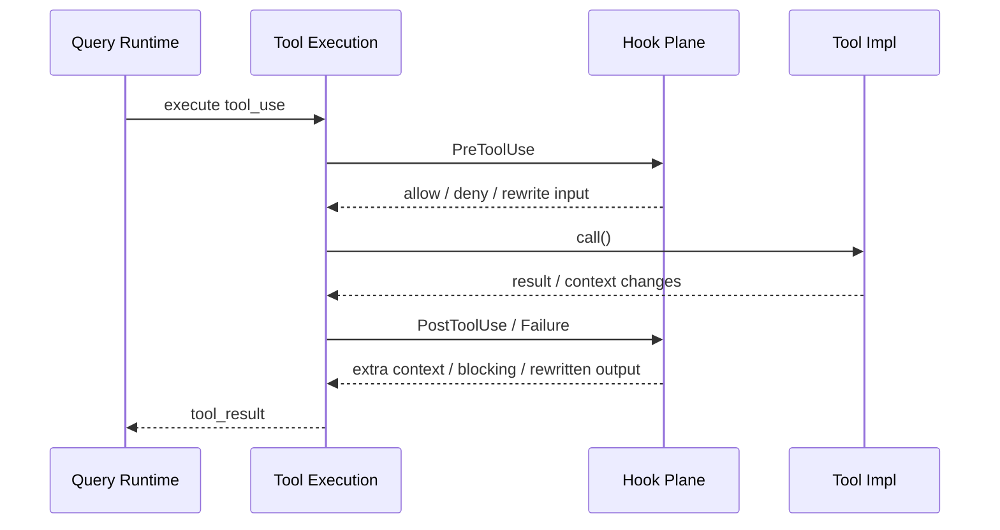

### 生命周期覆盖面
Hook 不是只有 pre/post tool：
- session start / end
- stop
- compact
- file changed
- config changed
- subagent start / stop
- task completed
- teammate idle

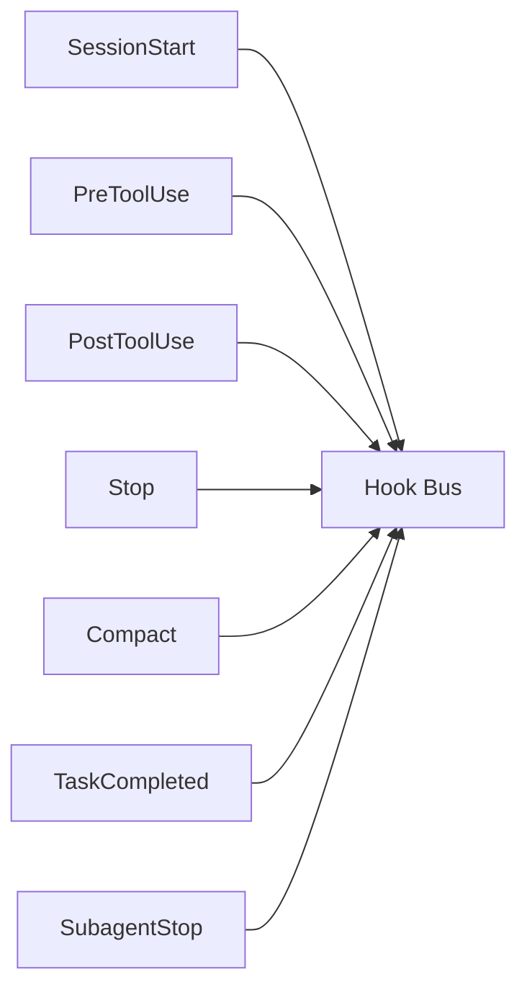

**核心结论：**
- Hook Plane 是**治理总线**
- 它把权限、审计、改写、阻断、附加上下文统统统一起来了

### 7.1 StopHooks：回合结束时的后台动作收口点

`query/stopHooks.ts` 不只是“最后收个尾”，它其实是整轮结束时的**后台动作调度中心**。

Stop 阶段会做几件不同层级的事：
- 生成 stop hook context
- 保存 cache-safe params
- 执行 stop hooks
- 触发 prompt suggestion
- 触发 extract memories
- 触发 auto dream
- 某些模式下做 job classification / computer-use cleanup

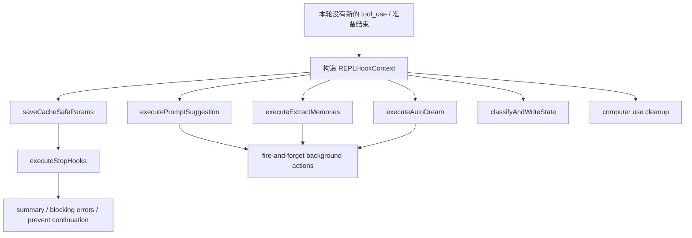

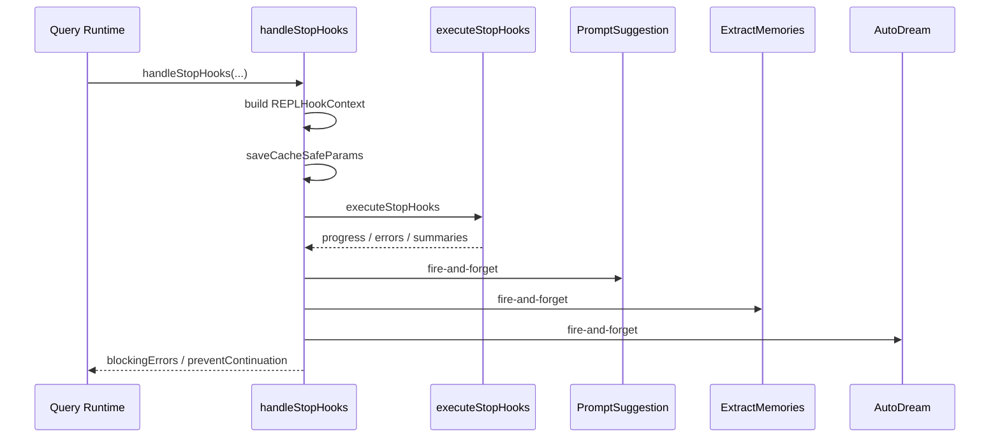

**核心结论：**
- stop 阶段是生命周期治理点
- 也是 prompt suggestion、memory extraction、auto dream 的统一收口点
- 所以它是“回合结束控制面”，不只是一个 finally 块

---

## 8. Memory Plane：这个仓最有层次感的一块

Memory 不是一个目录，而是一个平面。它至少有四层：

1. 持久记忆目录系统
2. Query 时相关记忆召回
3. Session Memory 滚动摘要
4. Stop 阶段 durable memory 提炼

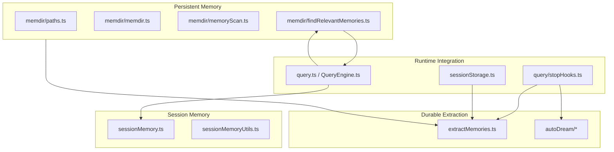

### 8.1 持久记忆目录系统
- `memdir/paths.ts`：memory 在哪、是否启用
- `memdir/memdir.ts`：memory prompt 怎么建
- `memoryScan.ts`：怎么扫目录和 frontmatter
- `findRelevantMemories.ts`：当前 query 取哪些 memory

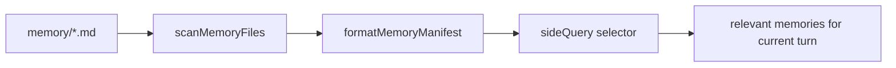

### 8.2 Session Memory
它不是长期记忆，更像**长会话滚动摘要**。

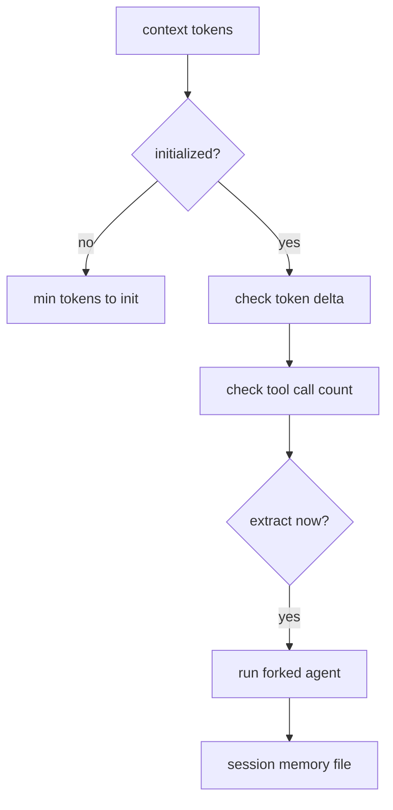

### 8.3 Stop 阶段 Durable Memory 提炼
stop 阶段不仅结束回合，还会触发后台记忆动作。

```mermaid
flowchart TD
    Stop[handleStopHooks] --> StopHooks[executeStopHooks]
    Stop --> Suggest[PromptSuggestion]
    Stop --> Extract[executeExtractMemories]
    Stop --> Dream[executeAutoDream]
    Extract --> RestrictedAgent[forked restricted agent]
    RestrictedAgent --> AutoMemoryDir[auto memory directory only]
```

**核心结论：**
- 持久记忆、会话摘要、durable 提炼是三种不同东西
- 这个仓把三者清楚分开了

---

## 9. Extension Plane：它不是闭门造车，是平台化系统

扩展平面包括四类东西：
- MCP
- LSP
- Skills
- Plugins

```mermaid
flowchart TD
    Query[Query Runtime] --> MCP[services/mcp/*]
    Query --> LSP[services/lsp/*]
    Query --> Skills[skills/*]
    Query --> Plugins[plugins/* + utils/plugins/*]

    MCP --> ToolPool[tool pool]
    LSP --> ToolPool
    Skills --> Commands[command plane]
    Skills --> Prompt[system prompt / context]
    Plugins --> Skills
    Plugins --> Commands
    Plugins --> MCP
    Plugins --> LSP
```

### 9.1 MCP：外部能力接入总线
MCP 子系统不是薄封装，而是完整接入层：
- transport
- auth / oauth
- tool discovery
- resource discovery
- prompt discovery
- output truncation / binary persistence

```mermaid
flowchart LR
    MCPConfig[server config] --> Client[MCP client]
    Client --> Transport[stdio / SSE / HTTP / WS]
    Client --> Discovery[list tools/resources/prompts]
    Discovery --> Wrapper[MCPTool / ReadMcpResourceTool / AuthTool]
    Wrapper --> ToolPool
```

### 9.1.1 MCP client 细化：transport / auth / discovery / tool call

```mermaid
flowchart TD
    Config[ScopedMcpServerConfig] --> Connect[connectToServer]
    Connect --> Transport{transport type}
    Transport --> Stdio[StdioClientTransport]
    Transport --> SSE[SSEClientTransport]
    Transport --> HTTP[StreamableHTTPClientTransport]
    Transport --> WS[WebSocketTransport]
    Transport --> SDK[SdkControlClientTransport]

    Connect --> Auth[OAuth / token refresh / 401 handling]
    Connect --> Session[session auth token / headers / proxy / mTLS]
    Connect --> Client[Model Context Protocol Client]

    Client --> Discovery[ListTools / ListResources / ListPrompts]
    Discovery --> WrapTools[MCPTool wrappers]
    Discovery --> WrapResources[Read/List resource tools]
    Discovery --> WrapAuth[McpAuthTool]

    WrapTools --> ToolPool[tool pool]
    WrapResources --> ToolPool
    WrapAuth --> ToolPool
```

```mermaid
sequenceDiagram
    participant Runtime as Query Runtime
    participant MCPTool as MCPTool wrapper
    participant Client as MCP client
    participant Auth as OAuth/Auth helpers
    participant Server as MCP server
    participant Storage as output storage

    Runtime->>MCPTool: call MCP tool
    MCPTool->>Client: callTool(...)
    Client->>Auth: check/refresh token if needed
    Auth-->>Client: token ready / auth error
    Client->>Server: JSON-RPC request over selected transport
    Server-->>Client: result / error / binary content
    Client->>Storage: truncate / persist binary / resize image if needed
    Client-->>MCPTool: normalized result
    MCPTool-->>Runtime: tool_result
```

**MCP client 的实际职责不是“帮你发个请求”，而是：**
- 屏蔽多 transport 差异
- 处理 OAuth / 401 / session 过期
- 把 tools/resources/prompts 统一映射进系统
- 管理大输出、二进制内容、图片 resize/downsample、tool result persist

这也是为什么 `services/mcp/client.ts` 会这么大——它本质上是一个**外部能力接入中枢**。

### 9.2 LSP：语义代码理解子系统
LSP 在这仓里不是一个 tool 文件，而是完整 server manager。

```mermaid
flowchart TD
    File[file path] --> Manager[LSPServerManager]
    Manager --> Instance[LSPServerInstance]
    Instance --> Client[LSPClient JSON-RPC]
    Client --> Diagnostics[diagnostics registry]
    Client --> LSPTool[LSPTool]
    LSPTool --> Query
```

### 9.3 Skills：轻量工作流与规则单元
skills 更像 markdown/frontmatter 驱动的扩展描述。

```mermaid
flowchart LR
    SkillFile[skill markdown + frontmatter] --> Parser[loadSkillsDir]
    Parser --> Command[skill commands]
    Parser --> PromptCtx[prompt context]
    Parser --> HookCfg[skill hooks]
    Parser --> ToolConstraints[allowed-tools / execution context]
```

### 9.4 Plugins：高阶分发与打包层
Plugin 是更重的扩展壳。

```mermaid
flowchart TD
    PluginPkg[Plugin Package] --> PSkills[plugin skills]
    PluginPkg --> PCmds[plugin commands]
    PluginPkg --> PMCP[plugin MCP]
    PluginPkg --> PLSP[plugin LSP]
    PSkills --> Skills
    PCmds --> Commands
    PMCP --> MCP
    PLSP --> LSP
```

**核心结论：**
- MCP 解决外部接入
- LSP 解决语义代码能力
- Skills 解决轻量规则 / workflow 固化
- Plugins 解决打包分发

---

## 10. Collaboration Plane：这玩意儿真的是多代理系统

这里不是“随便开几个子任务”，而是正式的 agent / task / team runtime。

```mermaid
flowchart TD
    Query[Query Runtime] --> AgentTool[AgentTool]
    AgentTool --> RunAgent[runAgent.ts]
    AgentTool --> LocalTask[LocalAgentTask]
    AgentTool --> RemoteTask[RemoteAgentTask]
    AgentTool --> Teammate[InProcessTeammateTask]
    AgentTool --> Worktree[worktree isolation]
    AgentTool --> Team[team / teammate / SendMessage]
```

### 10.1 AgentTool 是协作入口，不只是一个工具
它能决定：
- subagent type
- model
- background / foreground
- worktree / remote isolation
- team_name
- permission mode
- cwd

```mermaid
flowchart LR
    Input[prompt + description + agent type + isolation + mode] --> AgentTool
    AgentTool --> Sync[completed]
    AgentTool --> Async[async_launched]
    AgentTool --> Remote[remote_launched]
    AgentTool --> TeamSpawn[teammate_spawned]
```

### 10.2 Task Runtime 是正式底座
`Task.ts` 明确建模了统一任务生命周期：
- `pending`
- `running`
- `completed`
- `failed`
- `killed`

```mermaid
stateDiagram-v2
    [*] --> Pending
    Pending --> Running
    Running --> Completed
    Running --> Failed
    Running --> Killed
```

### 10.3 LocalAgentTask：可观测 agent 执行单元
本地 agent task 不只是记录结果，还维护：
- progress
- messages
- outputFile / outputOffset
- background / foreground
- retain / evict
- pendingMessages

```mermaid
flowchart TD
    AssistantMessages[agent assistant messages] --> ProgressParse[parse usage + tool_use]
    ProgressParse --> ToolCount[toolUseCount]
    ProgressParse --> TokenCount[token counters]
    ProgressParse --> Activities[recent activities]
    Activities --> TaskState[task.progress]
    TaskState --> Panel[task panel]
    TaskState --> Footer[background task footer]
```

### 10.3.1 AgentTool + Task Runtime 更细状态流

AgentTool 真正落地时，至少要跨过四层：
- 选择 agent definition
- 选择隔离/运行方式
- 注册 task runtime
- 将执行过程映射到 AppState / transcript / output file

```mermaid
flowchart TD
    Request[AgentTool request] --> ResolveAgent[resolve agent definition / model / permissions]
    ResolveAgent --> Isolation{isolation / target}
    Isolation --> Local[local agent]
    Isolation --> Worktree[worktree agent]
    Isolation --> Remote[remote agent]
    Isolation --> Teammate[in-process teammate]

    Local --> RegisterTask[register LocalAgentTask]
    Worktree --> RegisterTask
    Remote --> RegisterRemote[register RemoteAgentTask]
    Teammate --> RegisterMate[register InProcessTeammateTask]

    RegisterTask --> RunAgent[runAgent.ts]
    RegisterRemote --> RemoteExec[remote execution path]
    RegisterMate --> RunAgent

    RunAgent --> Stream[query() stream from subagent]
    Stream --> Progress[updateProgressFromMessage]
    Stream --> Sidechain[record sidechain transcript / output file]
    Progress --> AppState[AppState.tasks]
    Sidechain --> AppState
    AppState --> UI[panel / footer / notifications]
```

```mermaid
stateDiagram-v2
    [*] --> Created
    Created --> Pending
    Pending --> RunningForeground
    RunningForeground --> RunningBackground: backgrounded
    RunningForeground --> Completed
    RunningForeground --> Failed
    RunningForeground --> Killed
    RunningBackground --> Completed
    RunningBackground --> Failed
    RunningBackground --> Killed
    Completed --> Retained
    Failed --> Retained
    Killed --> Retained
    Retained --> Evicted
```

```mermaid
flowchart LR
    AgentMessages[agent messages] --> ProgressTracker[ProgressTracker]
    ProgressTracker --> Usage[input/output token accounting]
    ProgressTracker --> Activities[recent tool activities]
    ProgressTracker --> Summary[AgentProgress summary]
    Summary --> TaskState[LocalAgentTaskState.progress]
```

**核心结论：**
- AgentTool 不是“起个子 prompt”
- 它背后挂着 task 注册、sidechain transcript、output file、progress tracker、UI retain/evict 这些正式运行时结构
- 所以这个仓的多代理能力是 runtime 级，不是 prompt trick

### 10.4 Team / Teammate
team 能力分散在多个点，但语义很完整：
- team create / delete
- teammate spawn
- name registry
- mailbox / send message
- foreground / viewing 状态

```mermaid
flowchart LR
    TeamCreate[TeamCreateTool] --> Registry[agentNameRegistry / team context]
    AgentTool --> Registry
    SendMessage[SendMessageTool] --> Registry
    Registry --> TargetAgent[teammate task / agent task]
```

**核心结论：**
- 多代理不是外挂，是系统级能力
- task 是协作层的统一运行时对象

---

## 11. State / Persistence Plane：真正让系统“能长期跑”的底座

### 11.1 共享事实源：`AppStateStore.ts`
`AppState` 很大，但这不是坏事，它代表系统是多平面的。

它持有：
- UI 状态
- tool permission state
- tasks registry
- mcp / plugins / agent definitions
- fileHistory / attribution / todos
- notification / elicitation queue
- teammate / remote / bridge / browser / tmux 等状态

```mermaid
flowchart LR
    Query --> AppState
    Tools --> AppState
    Tasks --> AppState
    MCP --> AppState
    Plugins --> AppState
    UI --> AppState
```

### 11.2 Transcript 底座：`sessionStorage.ts`
这层负责：
- transcript jsonl
- resume / fork / branch
- parentUuid chain
- old transcript compatibility
- worktree session persistence

```mermaid
flowchart TD
    Message[message entry] --> Check{is transcript message?}
    Check -->|yes| Chain[parentUuid chain]
    Chain --> JSONL[session JSONL]
    JSONL --> Resume[resume / fork / branch / load]
    Resume --> Rebuild[rebuild runtime message chain]
```

### 11.3 文件历史：`fileHistory.ts`
这层解决的是“对话之外，文件怎么留痕”。

```mermaid
sequenceDiagram
    participant Tool as Edit / Write Tool
    participant History as fileHistory.ts
    participant Backup as backup files
    participant Storage as sessionStorage

    Tool->>History: trackEdit(file, messageId)
    History->>Backup: backup pre-edit content
    Tool->>History: makeSnapshot(messageId)
    History->>Storage: record file history snapshot
```

### 11.4 任务输出 sidechain
后台任务不直接把所有输出塞进主 transcript，而是走 side output file。

```mermaid
flowchart LR
    Task[background task] --> OutputFile[task output file]
    OutputFile --> OffsetRead[incremental offset reads]
    OffsetRead --> UI[task panel / notifications]
    OutputFile --> ToolFollowup[future reads by tools]
```

**核心结论：**
- transcript、file history、task output 分别承担不同维度的持久化
- 这才是长会话、多任务、可恢复系统的底座

---

## 12. 目录视角：源码为什么看起来那么大

`src/` 里文件量最大的目录，大致说明复杂度分布：
- `utils/`
- `components/`
- `commands/`
- `tools/`
- `services/`
- `hooks/`
- `ink/`

```mermaid
flowchart TD
    Src[src/] --> Utils[utils\n横切基础设施]
    Src --> Components[components\n终端 UI]
    Src --> Commands[commands\n控制面]
    Src --> Tools[tools\n执行能力]
    Src --> Services[services\n子系统承载]
    Src --> Hooks[hooks\nUI hooks]
    Src --> Ink[ink\n终端框架层]
    Src --> Query[query\n主循环辅助]
    Src --> Memdir[memdir\nmemory]
    Src --> State[state\n共享状态]
```

**核心结论：**
这仓不是“核心逻辑在一个地方”，而是：
- 总控在 `query`
- 横切在 `utils`
- 子系统在 `services`
- 具体能力在 `tools`
- 承载层在 `components / ink`

---

## 13. 一页理解依赖方向

```mermaid
flowchart LR
    Main[main.tsx] --> Runtime[query.ts / QueryEngine.ts]
    Main --> Interaction[commands / repl / UI]

    Runtime --> ToolPlane[Tool Plane]
    Runtime --> HookPlane[Hook Plane]
    Runtime --> MemoryPlane[Memory Plane]
    Runtime --> ExtensionPlane[Extension Plane]
    Runtime --> CollabPlane[Collaboration Plane]
    Runtime --> StatePlane[State Plane]

    ToolPlane --> StatePlane
    HookPlane --> StatePlane
    MemoryPlane --> StatePlane
    ExtensionPlane --> StatePlane
    CollabPlane --> StatePlane
    Interaction --> StatePlane
```

**一句话：**
所有复杂度最后都汇回到 `Query Runtime + State Plane` 这两条主轴上。

---

## 14. 如果只记 10 个文件，记这 10 个

```mermaid
mindmap
  root((Top 10 Files))
    main.tsx
    query.ts
    QueryEngine.ts
    Tool.ts
    tools.ts
    services/tools/toolOrchestration.ts
    query/stopHooks.ts
    memdir/memdir.ts
    tools/AgentTool/AgentTool.tsx
    utils/sessionStorage.ts
```

### 为什么是这 10 个
- `main.tsx`：启动装配
- `query.ts`：交互主循环
- `QueryEngine.ts`：headless 会话引擎
- `Tool.ts`：工具协议
- `tools.ts`：工具池
- `toolOrchestration.ts`：执行编排
- `stopHooks.ts`：stop 阶段收口
- `memdir/memdir.ts`：memory prompt 中心
- `AgentTool.tsx`：多代理入口
- `sessionStorage.ts`：transcript / 恢复底座

---

## 15. 最终结论：怎么给这个仓下定义

如果只用一句话定义它：

> **Claude Code Build 是一个以 Query Runtime 为中心、以 Tool Plane 为执行臂、以 Hook Plane 为治理层、以 Memory / Extension / Collaboration 为增强平面、以 State / Persistence 为底座的终端原生 Agent 平台。**

如果再压缩成三句话：

1. **运行时核心在 `query.ts / QueryEngine.ts`，不是在 UI。**
2. **Memory、MCP/LSP、Agent/Task 这些都不是附属功能，而是正式子系统。**
3. **真正让它像产品而不是 demo 的，是 stop hooks、session storage、file history、task runtime 这些底座。**

---

## 16. 建议怎么用这篇文档

如果你想拿这篇去做汇报或者快速讲架构，我建议直接按下面顺序讲：

```mermaid
flowchart LR
    A[全局图] --> B[主循环]
    B --> C[Tool / Hook / Command 三线]
    C --> D[Memory 平面]
    D --> E[Extension 平面]
    E --> F[Collaboration 平面]
    F --> G[State / Persistence 底座]
```

这条线是最顺的：
- 先讲总控
- 再讲执行与治理
- 再讲系统特色模块
- 最后讲底座

讲起来不容易散，也最像真正的设计说明。