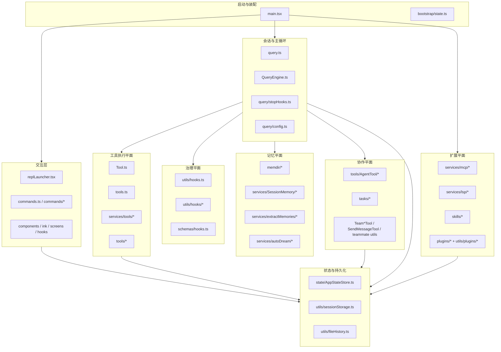
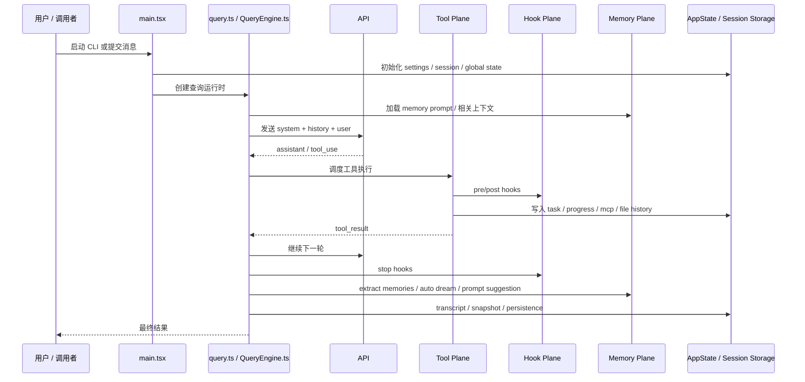

# 1. 系统总览

## 1.1 系统定位

该仓库实现的是一套终端原生的 agent 系统。其核心不只是“CLI + 模型调用 + 工具”，而是由多个长期稳定的运行时平面组成：

- 启动与装配
- 会话与查询运行时
- 工具执行平面
- 生命周期治理平面
- 记忆与上下文平面
- 扩展平面（MCP / LSP / Skills / Plugins）
- 协作平面（Agent / Task / Team）
- 状态与持久化底座
- 终端交互层

从职责上看，这些平面并不是松散拼接，而是围绕 Query Runtime 组织起来的。

---

## 1.2 一级架构视图

---

## 1.3 核心控制权分布

### 启动控制权
由 `main.tsx` 持有。负责：
- CLI 参数解析
- settings / auth / policy / analytics 预热
- commands / skills / agents / MCP / LSP 装配
- 决定进入 REPL 还是 headless 路径

### 回合控制权
由 `query.ts` / `QueryEngine.ts` 持有。负责：
- 消息历史
- system prompt 与 context 组装
- 调模型
- 处理 `tool_use`
- 决定继续、停止、压缩、恢复

### 执行控制权
由 `services/tools/*` 持有。负责：
- 单 tool_use 执行
- 串/并发调度
- 中断、失败与结果回流

### 治理控制权
由 `utils/hooks.ts` 持有。负责：
- 按生命周期事件挂接外部治理逻辑
- 在 pre/post/stop/session 等阶段插入策略与回调

### 共享事实源
由 `state/AppStateStore.ts` 与 `utils/sessionStorage.ts` 等持有。负责：
- UI 状态
- Task 状态
- MCP / Plugin / Agent / Permission 共享状态
- transcript、恢复与历史

---

## 1.4 这套系统最像什么

从架构风格上，它更接近如下组合：

- **Runtime-centric Architecture**：一切围绕会话运行时组织，而不是围绕页面或单次请求
- **Control Plane / Execution Plane 分离**：query 控制、tools 执行、hooks 治理
- **Platform-like Extension Architecture**：MCP、LSP、Skills、Plugins 同时存在且是正式接入面
- **Agent Collaboration Runtime**：subagent、task、team 不是附属功能，而是正式运行时能力

---

## 1.5 系统的全局主线

---

## 1.6 对后续阅读最重要的判断

1. `main.tsx` 是装配中心，不是业务核心
2. `query.ts` / `QueryEngine.ts` 是会话运行时核心
3. `Tool.ts` / `tools.ts` / `services/tools/*` 构成执行平面
4. `utils/hooks.ts` 是治理平面，而不是简单 callback 集合
5. `memdir + SessionMemory + extractMemories` 共同构成记忆平面
6. `MCP / LSP / Skills / Plugins` 构成扩展平面
7. `AgentTool / Tasks / Teams` 构成协作平面
8. `AppState + sessionStorage` 是共享事实源与持久化底座

后面的章节会沿着这 8 个点展开。