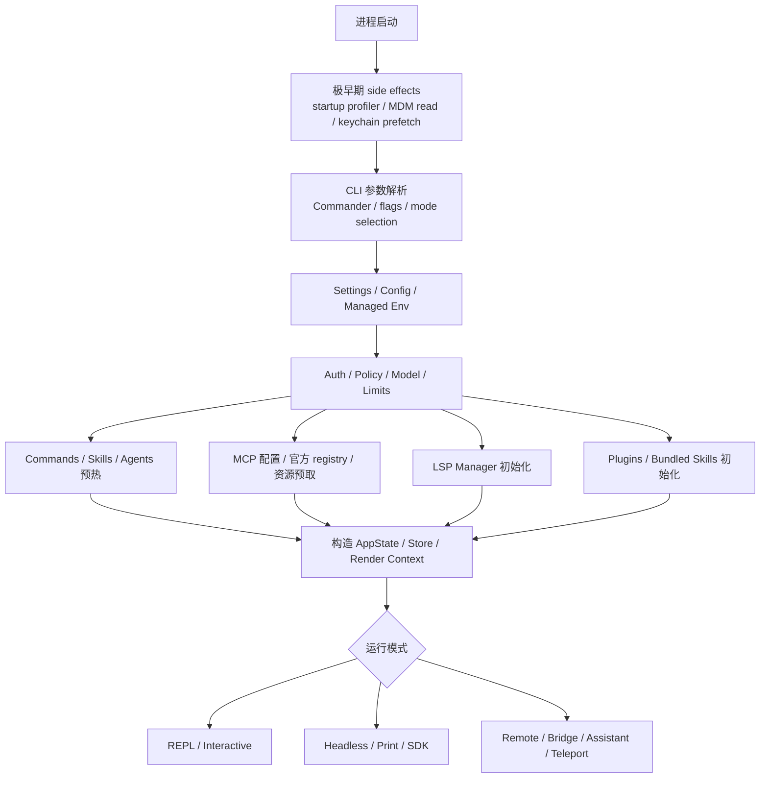
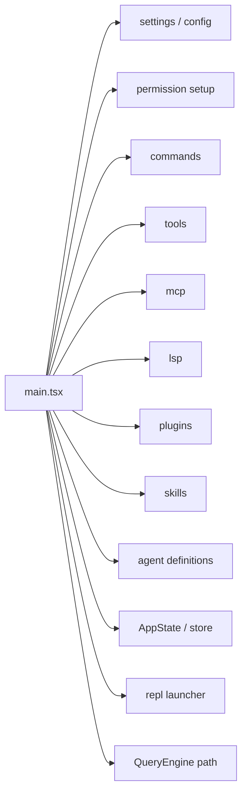

# 2. 启动与装配：`main.tsx`

`main.tsx` 是整个系统的 Composition Root。它承担的职责不是实现具体业务，而是将：

- 运行模式
- 设置系统
- 权限与策略
- 插件与技能
- MCP 与 LSP
- REPL 与 headless 路径
- session / remote / bridge / assistant 模式

装配到同一个进程里。

---

## 2.1 启动阶段结构图

---

## 2.2 顶层 side effects

`main.tsx` 在最开始就做了三类 side-effect：

1. `profileCheckpoint('main_tsx_entry')`
2. `startMdmRawRead()`
3. `startKeychainPrefetch()`

这说明启动性能被当作一等问题处理。部分 I/O 在 import 阶段就开始并行预热，而不是等整个模块树加载完成后再串行执行。

---

## 2.3 启动时装配的主要子系统

从 import 结构可以看出，`main.tsx` 直接触达的子系统非常多：

### 运行时核心
- `query.ts`
- `replLauncher.tsx`
- `interactiveHelpers.tsx`
- `bootstrap/state.ts`
- `state/*`

### 扩展系统
- `services/mcp/*`
- `plugins/bundled/index.ts`
- `skills/bundled/index.ts`
- `tools/AgentTool/loadAgentsDir.ts`
- `services/lsp/manager.ts`

### 策略与环境
- `utils/settings/*`
- `utils/permissions/*`
- `services/policyLimits/*`
- `utils/managedEnv.ts`
- `utils/auth.ts`

### 远端与桥接
- `remote/*`
- `server/*`
- `utils/teleport/*`
- `utils/claudeInChrome/*`

### 交互与产品层能力
- `dialogLaunchers.ts`
- `utils/exampleCommands.ts`
- `utils/releaseNotes.ts`
- `commands/*`

这说明 `main.tsx` 不只是 CLI 入口，而是整个产品的装配中枢。

---

## 2.4 启动期的关键工作

### 1. 解析运行模式
系统会决定是否进入：
- 交互式 REPL
- 非交互输出
- SDK/headless
- remote / teleport / assistant / bridge

### 2. 预热配置与环境
包括：
- 本地设置
- 远端托管设置
- policy limits
- managed env variables
- auto updater 与 migration

### 3. 装配工具与命令能力
包括：
- commands
- built-in tools
- MCP tools/resources
- skills / plugin commands
- agent definitions

### 4. 初始化共享状态
包括：
- `AppState`
- `toolPermissionContext`
- plugin 状态
- mcp clients / resources
- remote / bridge 状态
- LSP manager

### 5. 决定界面承载方式
- 是否启用 Ink / 交互界面
- 是否直接走 headless query 路径
- 是否启用 daemon / bridge / assistant / remote 模式

---

## 2.5 为什么说它是 Composition Root

Composition Root 的典型特征是：
- 依赖极多
- 不负责细节执行
- 负责决定哪些实现被实例化、何时初始化、如何连接

`main.tsx` 完全符合这三个特征：

如果把它拿掉，系统中的很多子系统仍然存在；但没有一个统一位置能把它们装到一起。

---

## 2.6 `main.tsx` 暴露出的架构信号

### 信号 1：系统是多模式产品
不是单一 REPL。明显支持：
- interactive
- headless
- remote
- assistant / viewer
- bridge / daemon

### 信号 2：扩展与策略在启动阶段就是一等公民
MCP、plugins、skills、policy limits、managed settings 都在启动期参与。

### 信号 3：Query Runtime 不是唯一中心
虽然 Query Runtime 是运行时核心，但产品还有：
- environment preparation
- session restoration
- daemon / bridge
- plugin / mcp bootstrap
- auth / limits / release notes

这使系统更像完整产品，而不是一个 query loop 脚本。

---

## 2.7 适合从 `main.tsx` 追的调用链

阅读时建议优先关注这些调用链：

1. `main.tsx -> launchRepl`
2. `main.tsx -> QueryEngine / query`
3. `main.tsx -> getCommands / getTools`
4. `main.tsx -> getMcpToolsCommandsAndResources`
5. `main.tsx -> initializeLspServerManager`
6. `main.tsx -> initBuiltinPlugins / initBundledSkills`
7. `main.tsx -> createStore / getDefaultAppState`

这些链路能把全局结构串起来。

---

## 2.8 小结

`main.tsx` 的作用可以概括为：

- 读取环境与配置
- 初始化策略、权限、auth、limits
- 装配 commands / tools / MCP / LSP / plugins / skills / agents
- 初始化共享状态与 UI 上下文
- 决定运行模式
- 把控制权交给 Query Runtime 或其他模式入口

因此，分析整个项目时，`main.tsx` 适合作为“启动地图”，而不是“业务实现地图”。