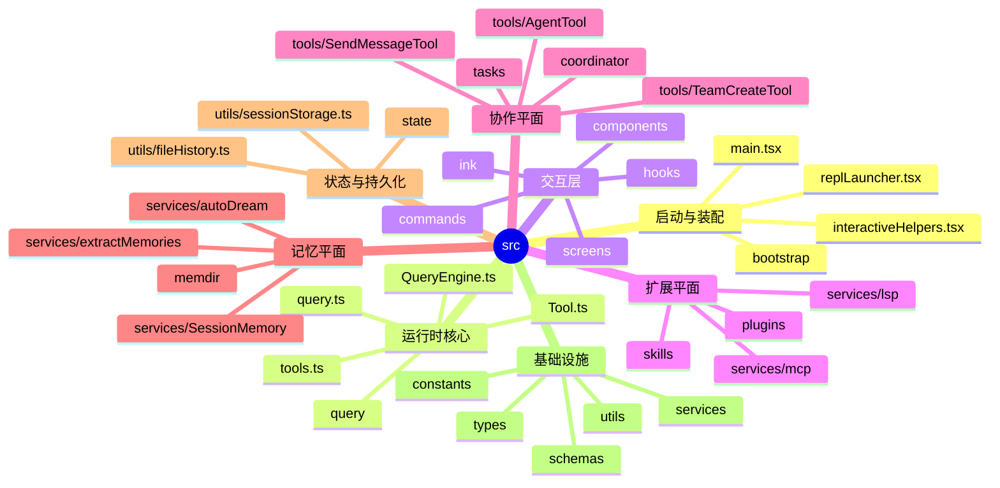
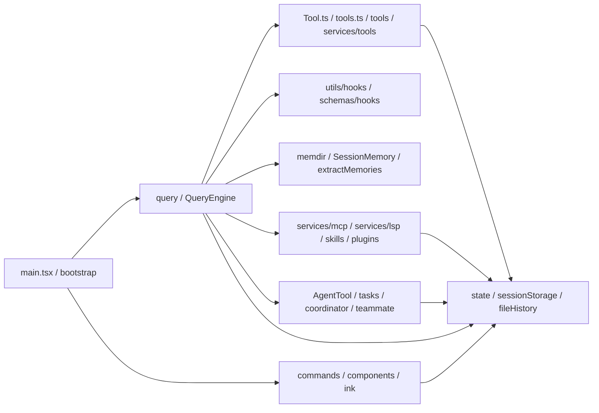

# 3. 目录结构与模块边界

## 3.1 顶层目录的架构映射

`src/` 下的目录并不是简单的“功能分类”，而是对多个运行时平面的直接映射。

---

## 3.2 目录规模信号

自动生成的目录统计见：
- [`docs/generated/directory-counts.md`](generated/directory-counts.md)

文件数最多的目录通常最能反映系统复杂度集中在哪里。当前仓库中，最显著的目录包括：

- `utils/`
- `components/`
- `commands/`
- `tools/`
- `services/`
- `hooks/`
- `ink/`

这说明该系统的复杂度主要集中在：

1. 横切基础设施（utils）
2. 工具与命令能力
3. 终端 UI 与交互层
4. 服务与扩展子系统

---

## 3.3 按平面划分目录

## A. 启动与装配目录

### `bootstrap/`
负责：
- 启动期状态
- runtime flags
- session id / cwd / model 等全局状态快照

### 根层文件
- `main.tsx`
- `replLauncher.tsx`
- `interactiveHelpers.tsx`

这些文件构成 Composition Root 与 REPL 启动桥梁。

---

## B. Query / Runtime 目录

### `query/`
负责：
- stop hooks
- token budget
- runtime config snapshot
- 主循环辅助逻辑

### 根层运行时文件
- `query.ts`
- `QueryEngine.ts`

这里是整个系统的控制核心。

---

## C. Tool Plane 目录

### `tools/`
负责：
- 各种正式工具的具体实现
- 包含 Bash、Read、Edit、Write、NotebookEdit、AgentTool、Task、MCP、LSP、Worktree 等工具

### `services/tools/`
负责：
- 工具编排
- 单次 tool_use 执行
- 流式工具执行
- 工具与 hooks 的接缝

### 根层文件
- `Tool.ts`
- `tools.ts`

其中：
- `Tool.ts` 定义协议
- `tools.ts` 定义工具池
- `tools/*` 提供实现
- `services/tools/*` 提供调度与运行时语义

---

## D. Governance / Hook 目录

### `utils/hooks.ts`
统一的 hook 执行中枢。

### `utils/hooks/`
拆分的 hook 子系统：
- AsyncHookRegistry
- sessionHooks
- postSamplingHooks
- hookEvents
- hook config snapshot
- 各类执行器

### `schemas/` 与 `types/hooks`
承载 hook 对应的 schema 与类型。

---

## E. Interaction Layer 目录

### `commands/`
正式命令系统。负责：
- built-in commands
- slash / local 命令
- 与 skills/plugins 的命令接缝

### `components/`
终端 UI 组件，承载：
- tool 展示
- notifications
- selectors
- panels
- diff / permissions UI
- remote / bridge / teammate / task 视图

### `ink/`
终端渲染、输入与框架封装。

### `screens/`
更高层的界面页或整屏视图。

### `hooks/`
React hooks / UI hooks。注意不要与 lifecycle hooks 混淆。

---

## F. Memory Plane 目录

### `memdir/`
持久记忆目录发现、路径管理、memory prompt 构建、memory relevance 选择、memory manifest 扫描。

### `services/SessionMemory/`
会话内 session memory 的周期性抽取与维护。

### `services/extractMemories/`
在 stop 阶段把 durable memories 提取到自动记忆目录。

### `services/autoDream/`
长期自动整理与后台记忆相关流程。

这一块构成系统最有特色的子系统之一。

---

## G. Extension Plane 目录

### `services/mcp/`
MCP 客户端、连接管理、auth、tool/resource/prompt 接入。

### `services/lsp/`
LSP server manager、client、instance、diagnostics registry。

### `skills/`
skills 目录发现、frontmatter、shell execution、MCP skill builders。

### `plugins/` + `utils/plugins/`
plugin manifest、命令、skills、LSP、MCP、缓存、refresh、marketplace、命名空间。

---

## H. Collaboration Plane 目录

### `tools/AgentTool/`
subagent 启动、fork、worktree、agent prompt、agent metadata、agent progress。

### `tasks/`
任务模型、task 状态与后台执行抽象。

### `coordinator/`
多代理协调模式。

### Team 相关工具与 utils
- `tools/TeamCreateTool/*`
- `tools/TeamDeleteTool/*`
- `tools/SendMessageTool/*`
- `utils/teammate*.ts`
- `utils/teamDiscovery.ts`
- `utils/teammateMailbox.ts`

---

## I. State / Persistence 目录

### `state/`
AppState、store、onChange handler。

### `utils/sessionStorage.ts`
transcript、恢复、session project dir、jsonl 记录、resume / fork / compact 边界。

### `utils/fileHistory.ts`
文件历史快照与变更轨迹。

### `utils/fileStateCache.ts`
读写态文件缓存。

---

## J. 通用基础设施目录

### `services/`
承载大量非工具型能力：
- analytics
- api
- compact
- PromptSuggestion
- policy limits
- release notes
- token estimation
- AgentSummary
- SessionMemory
- extractMemories
- autoDream

### `utils/`
最大横切基础设施目录，包含：
- config
- debug / diagnostics
- errors
- env
- fs
- git
- markdown/frontmatter
- model
- permissions
- messages
- sessionStorage
- hooks
- theme
- worktree
- teammate

如果要理解项目如何运转，`utils/` 是最需要反复穿梭的目录。

---

## 3.4 目录之间的依赖方向

---

## 3.5 目录级阅读优先级

### 第一层：运行时主线
- `main.tsx`
- `query.ts`
- `QueryEngine.ts`
- `Tool.ts`
- `tools.ts`
- `services/tools/*`
- `utils/hooks.ts`

### 第二层：系统特色模块
- `memdir/*`
- `services/SessionMemory/*`
- `services/extractMemories/*`
- `services/mcp/*`
- `services/lsp/*`
- `tools/AgentTool/*`
- `tasks/*`

### 第三层：交互和产品壳
- `commands/*`
- `components/*`
- `ink/*`
- `screens/*`

---

## 3.6 小结

目录结构清楚地表达了该系统的模块边界：

- 根层文件负责装配与总控
- `query / tools / hooks / state` 构成运行时核心
- `memdir / SessionMemory / extractMemories` 构成记忆平面
- `mcp / lsp / skills / plugins` 构成扩展平面
- `AgentTool / tasks / teams` 构成协作平面
- `commands / components / ink` 构成交互层

这种边界划分，使得该仓非常适合做系统化架构分析。