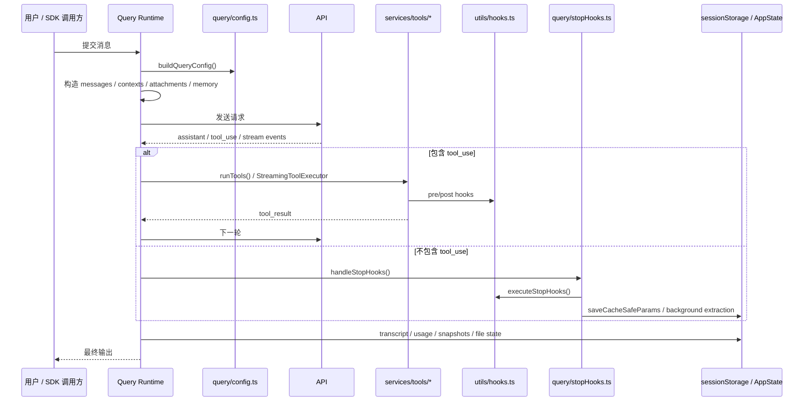
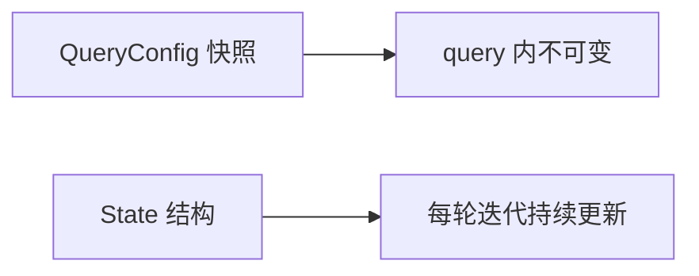
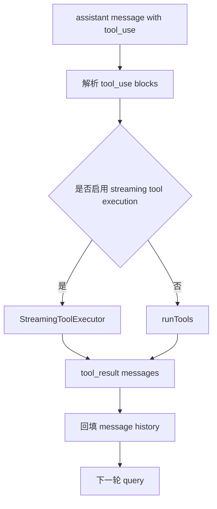
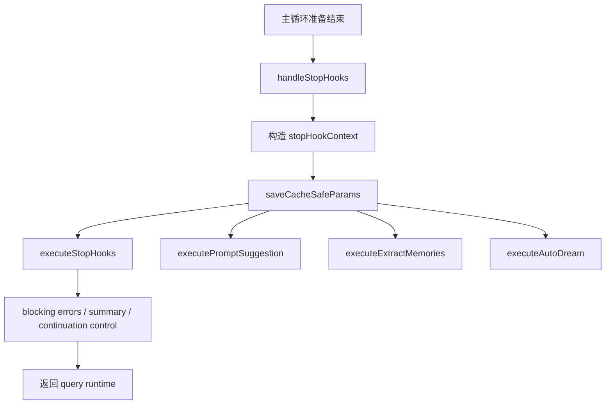
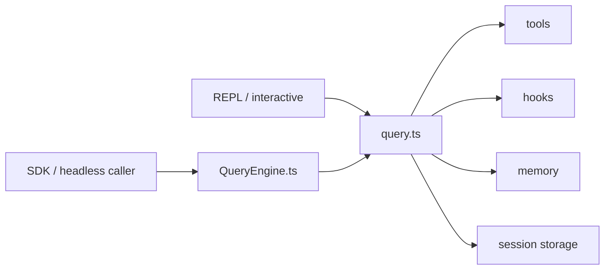

# 4. Query Runtime 与主循环

## 4.1 两条运行路径

系统中存在两条共享核心语义的运行路径：

1. **REPL / interactive 路径**：以 `query.ts` 为核心
2. **headless / SDK 路径**：以 `QueryEngine.ts` 为核心

两条路径都围绕同一组运行时问题展开：

- 维护 message history
- 构造 system prompt、user context、system context
- 发送模型请求
- 处理 assistant / tool_use
- 调度工具执行
- 执行 stop hooks
- 维护 transcript、usage、session state

---

## 4.2 主循环总图

---

## 4.3 `query.ts`：交互路径主循环

### 关键入口
- `query()`
- `queryLoop()`
- `yieldMissingToolResultBlocks()`

### `query()` 的角色
`query()` 是对 `queryLoop()` 的轻包装，负责：
- 执行主循环
- 在正常返回时通知命令生命周期完成
- 将消息流暴露给 REPL / 上层调用方

### `queryLoop()` 的角色
它是整个运行时的核心生成器。负责：
- 初始化 state
- 构建当前回合配置
- 维护多轮迭代状态
- 处理模型输出与恢复逻辑
- 协调工具调用与 stop 阶段

`queryLoop()` 并不是简单的“调用模型再返回”，而是一个真正的状态机。

---

## 4.4 `QueryEngine.ts`：Headless / SDK 会话引擎

### 关键对象
- `class QueryEngine`
- `submitMessage()`

`QueryEngine` 拥有持久会话状态：
- `mutableMessages`
- `readFileState`
- `abortController`
- `permissionDenials`
- `totalUsage`
- `discoveredSkillNames`
- `loadedNestedMemoryPaths`

### 它的职责
- 以类的方式封装会话生命周期
- 对外提供 `submitMessage()` 这样的稳定接口
- 复用 `query()` 的主循环语义
- 在 headless 模式下处理 transcript、usage、session flush

可以把它理解为：
- `query.ts`：更靠近交互主线程
- `QueryEngine.ts`：更靠近可嵌入会话引擎

---

## 4.5 Query 配置快照：`query/config.ts`

`buildQueryConfig()` 用于在 query 入口处快照一组运行时门控条件：

- `streamingToolExecution`
- `emitToolUseSummaries`
- `isAnt`
- `fastModeEnabled`
- `sessionId`

这个设计很关键，因为它把：
- 会在一个 query 中保持稳定的配置
- 和会随着每轮变化的 mutable state

区分开了。

---

## 4.6 主循环中的主要状态

`query.ts` 中的 `State` 结构包含：
- `messages`
- `toolUseContext`
- `autoCompactTracking`
- `maxOutputTokensRecoveryCount`
- `hasAttemptedReactiveCompact`
- `maxOutputTokensOverride`
- `pendingToolUseSummary`
- `stopHookActive`
- `turnCount`
- `transition`

这说明主循环需要同时管理：

1. 对话历史
2. 工具运行上下文
3. 上下文压缩状态
4. 恢复与重试状态
5. stop hooks 状态
6. 转移原因（继续、恢复、压缩等）

---

## 4.7 主循环如何处理 tool_use

主循环遇到 `tool_use` 时，执行路径大致如下：

其中：
- `StreamingToolExecutor` 用于流式到达时边接收边执行
- `runTools()` 用于常规工具批处理

---

## 4.8 压缩与恢复逻辑

`query.ts` 中能明显看到以下运行时问题被作为内建能力处理：

### 1. 自动压缩
- `services/compact/autoCompact`
- `services/compact/compact`
- `reactiveCompact`
- `snipCompact`

### 2. Prompt too long / max_output_tokens 恢复
- `isWithheldMaxOutputTokens(...)`
- `MAX_OUTPUT_TOKENS_RECOVERY_LIMIT`

### 3. Token budget
- `query/tokenBudget.ts`
- `getCurrentTurnTokenBudget()`
- `checkTokenBudget()`

这些能力说明：
该系统从一开始就不是“短对话工具”，而是为长会话、长上下文与 agentic turn 设计。

---

## 4.9 Stop 阶段：`query/stopHooks.ts`

Stop 阶段不是尾部细节，而是独立生命周期阶段。

### 关键入口
- `handleStopHooks()`

### 该阶段负责的事情
1. 构造 `REPLHookContext`
2. 保存 `cacheSafeParams`
3. 运行 `executeStopHooks(...)`
4. 在主线程 stop 后触发后台动作：
   - `executePromptSuggestion(...)`
   - `executeExtractMemories(...)`
   - `executeAutoDream(...)`
5. 收集 stop hook 的阻断、summary、progress 和 attachments
6. 对 task / teammate 场景触发额外 hook

这说明 stop 阶段既是：
- 生命周期治理点
也是：
- 记忆提炼与后台维护的统一收口点

---

## 4.10 REPL 路径和 SDK 路径的关系

关系可以总结为：
- REPL 直接以流式生成器方式驱动 `query.ts`
- SDK 通过 `QueryEngine.submitMessage()` 封装并复用 `query.ts`
- 共享核心运行时语义，但交互承载方式不同

---

## 4.11 关键阅读顺序

如果从 Query Runtime 入手，建议顺序为：

1. `query.ts`
2. `query/config.ts`
3. `query/stopHooks.ts`
4. `QueryEngine.ts`
5. `services/tools/toolOrchestration.ts`
6. `services/tools/StreamingToolExecutor.ts`

---

## 4.12 小结

Query Runtime 是整个系统的控制核心。它负责：

- 消息状态
- context 组装
- 模型请求
- 工具调用
- stop 阶段治理
- transcript / usage / persistence
- 长会话恢复与压缩

如果把系统比作多平面的 agent 产品：
- `main.tsx` 是装配中心
- `query.ts` / `QueryEngine.ts` 是心脏
- 其余平面围绕它协同运转