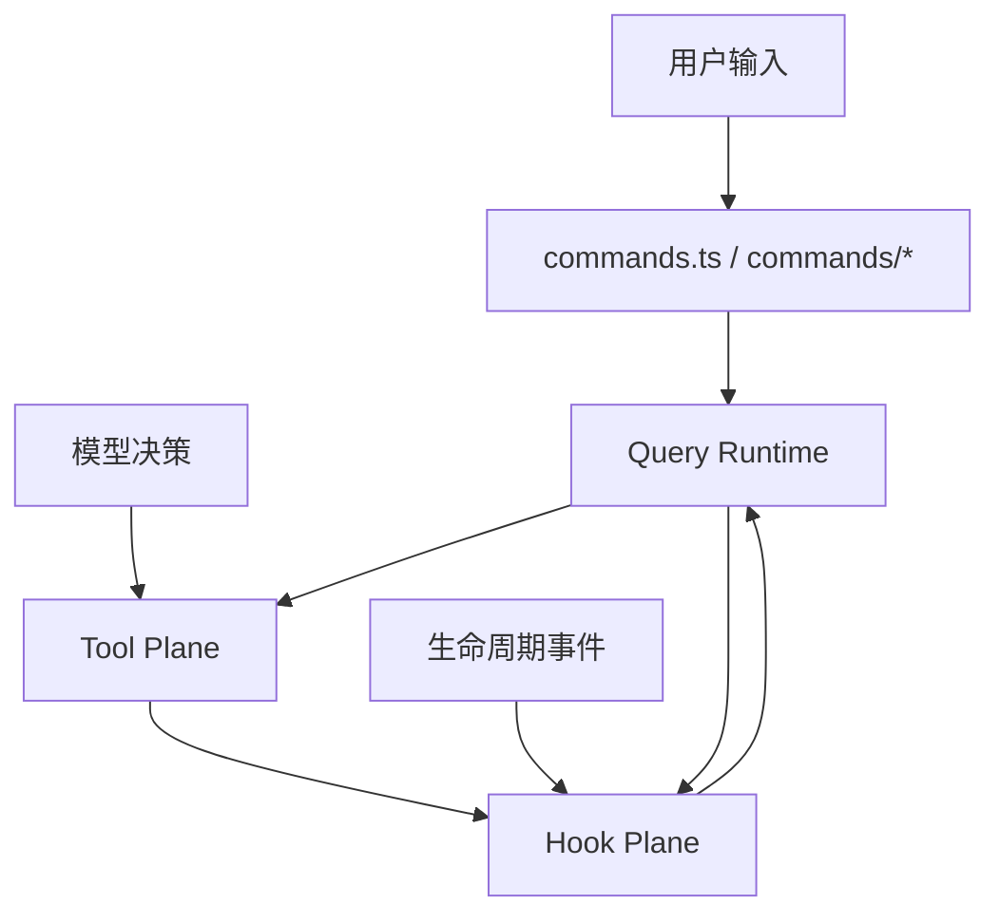
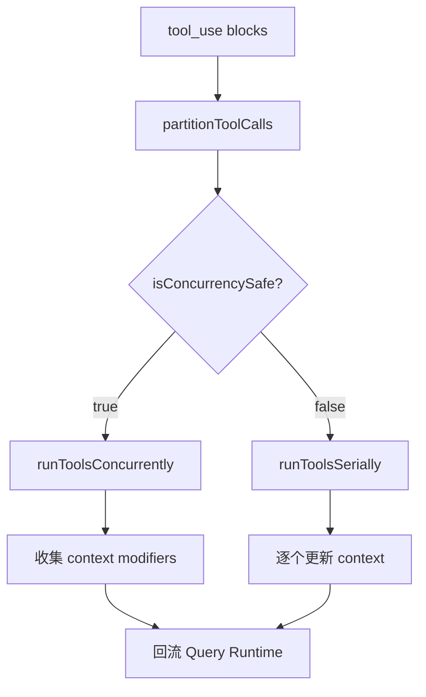
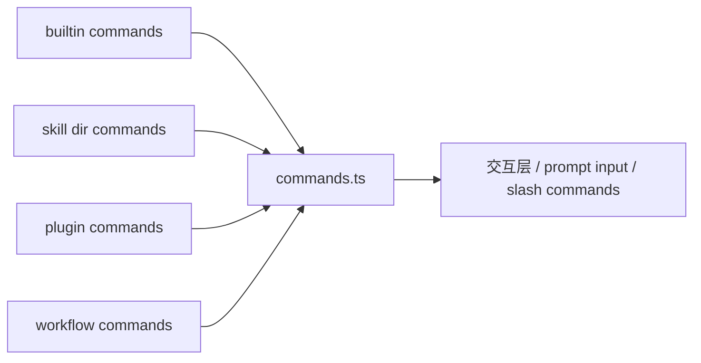
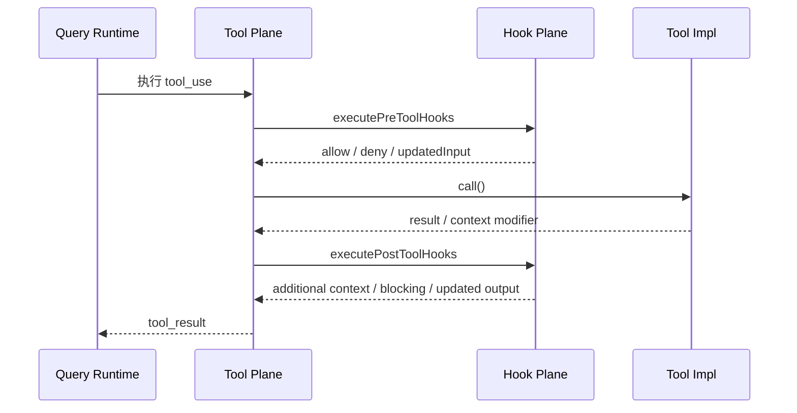

# 5. Tools / Commands / Hooks 架构

这一章分析三条并行但职责不同的控制路径：

- Tools：模型调用的执行能力
- Commands：用户显式触发的控制面
- Hooks：对生命周期施加治理与策略的平面

---

## 5.1 三条路径的关系

这三条路径的区别在于：

- **Commands**：由人直接显式触发
- **Tools**：由模型在运行时决定是否调用
- **Hooks**：由系统生命周期自动触发

---

## 5.2 Tool Plane

## 5.2.1 `Tool.ts`：统一工具协议

`Tool.ts` 定义了工具运行时所需的核心抽象，包括：

- `Tool`
- `Tools`
- `ToolUseContext`
- `ToolPermissionContext`
- `ValidationResult`
- `buildTool()`

### `ToolUseContext` 的意义
`ToolUseContext` 不是简单参数包，而是工具执行时可访问的运行时上下文：

- `options.tools / commands / mcpClients / mcpResources`
- `readFileState`
- `getAppState / setAppState`
- `messages`
- `appendSystemMessage`
- `sendOSNotification`
- `updateFileHistoryState`
- `updateAttributionState`
- `agentId / agentType`

这说明工具不是独立函数，而是运行在完整 runtime 中的能力对象。

---

## 5.2.2 `tools.ts`：工具池装配器

`tools.ts` 负责：
- 注册所有 base tools
- 根据 feature flag、环境和权限上下文决定哪些工具暴露给模型
- 合并 MCP tools 与其他动态能力

### 当前工具池中的代表性工具
- `AgentTool`
- `BashTool`
- `FileReadTool`
- `FileEditTool`
- `FileWriteTool`
- `NotebookEditTool`
- `LSPTool`
- `WebFetchTool`
- `WebSearchTool`
- `TodoWriteTool`
- `Task*Tool`
- `ListMcpResourcesTool`
- `ReadMcpResourceTool`
- `SendMessageTool`
- `TeamCreateTool / TeamDeleteTool`

这反映出系统支持的不只是代码操作，还包括：
- 多代理协作
- 资源读取
- 任务管理
- 规划模式
- worktree / remote / workflow / cron 等附加能力

---

## 5.2.3 `services/tools/toolOrchestration.ts`：多工具批调度

`runTools()` 负责按并发安全性分批：
- 并发安全工具进入并发批次
- 非并发安全工具串行执行

### 批次划分逻辑
`partitionToolCalls()` 的规则是：
- 若 `tool.isConcurrencySafe(input)` 为真，则归入只读/安全批次
- 否则单独成批，串行执行

这说明工具执行平面关注的不仅是“执行”，还包括：
- 并发边界
- context modifier 生效时机
- in-progress tool use IDs 的维护

---

## 5.2.4 Tool Plane 的关键文件

- `Tool.ts`
- `tools.ts`
- `services/tools/toolOrchestration.ts`
- `services/tools/toolExecution.ts`
- `services/tools/StreamingToolExecutor.ts`
- `services/tools/toolHooks.ts`

这些文件共同定义了：
- 工具协议
- 工具池形成
- 工具执行语义
- 工具与 hook 的接缝

---

## 5.3 Commands 控制面

## 5.3.1 `commands.ts` 的角色
`commands.ts` 是命令聚合中心，导入了大量 built-in commands，以及：
- skills 提供的命令
- plugins 提供的命令
- workflow 命令
- 内部模式命令

### 命令的来源
- `commands/*`
- `skills/loadSkillsDir.ts`
- `plugins/*`
- `utils/plugins/loadPluginCommands.ts`

### 命令系统的意义
命令系统说明：
- 该系统不是完全依赖自然语言
- 存在明确的用户控制面
- 一部分高价值工作流通过显式命令暴露，而不是交给模型自行选择

---

## 5.3.2 命令系统的结构层次

命令系统在这个架构中的地位是：
- 对用户：控制面
- 对系统：扩展点之一

---

## 5.4 Hook Plane

## 5.4.1 `utils/hooks.ts` 的职责
`utils/hooks.ts` 是生命周期治理中枢。其职责包括：

- 构造不同 hook event 的输入
- 匹配命中 hooks
- 执行 shell / prompt / agent / http / function hooks
- 解释 hook 输出
- 把阻断、附加上下文、updated input / output 回流到运行时

### Hook 类型
从代码可见，hook 支持多种执行方式：
- command hook
- prompt hook
- agent hook
- http hook
- callback / function hook

这说明 hook 并非简单 shell 命令集合，而是统一的治理执行框架。

---

## 5.4.2 生命周期事件
Hook Plane 明确建模了大量生命周期事件，例如：

- `PreToolUse`
- `PostToolUse`
- `PostToolUseFailure`
- `SessionStart`
- `SessionEnd`
- `Stop`
- `StopFailure`
- `PreCompact`
- `PostCompact`
- `ConfigChange`
- `FileChanged`
- `InstructionsLoaded`
- `SubagentStart`
- `SubagentStop`
- `TaskCreated`
- `TaskCompleted`
- `TeammateIdle`

这说明 hook 系统覆盖范围很广，横跨：
- 工具生命周期
- 会话生命周期
- 配置与环境变化
- 多代理协作生命周期

---

## 5.4.3 Hook Plane 与 Tool Plane 的接缝

这里的重点是：
- Tool Plane 负责执行
- Hook Plane 负责治理
- Query Runtime 负责最终控制权

---

## 5.5 三条路径在系统中的分工

| 路径 | 触发者 | 目标 | 代表文件 |
|---|---|---|---|
| Tools | 模型 | 执行能力 | `Tool.ts`, `tools.ts`, `services/tools/*`, `tools/*` |
| Commands | 用户 | 显式控制 | `commands.ts`, `commands/*` |
| Hooks | 生命周期事件 | 治理与策略 | `utils/hooks.ts`, `utils/hooks/*` |

---

## 5.6 为什么这三条路径必须分开

### 不把 Commands 混入 Tools
因为：
- command 是用户显式意图
- tool 是模型决策能力

### 不把 Hooks 混入 Tools
因为：
- hook 是治理，不是执行
- 它作用于生命周期，而不直接承载业务能力

### 不把 Hooks 混入 Commands
因为：
- command 是交互控制面
- hook 是自动触发的系统行为

这种拆分让系统在长期演进中保持边界清晰。

---

## 5.7 小结

这一章的核心判断是：

1. Tool Plane 提供“系统能做什么”
2. Command Plane 提供“用户如何显式控制系统”
3. Hook Plane 提供“系统如何在生命周期中被治理”

这三条路径共同构成了该仓的控制与执行体系。