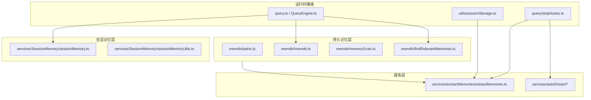
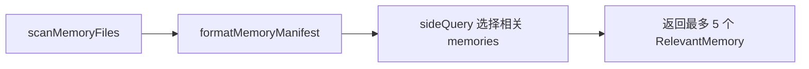
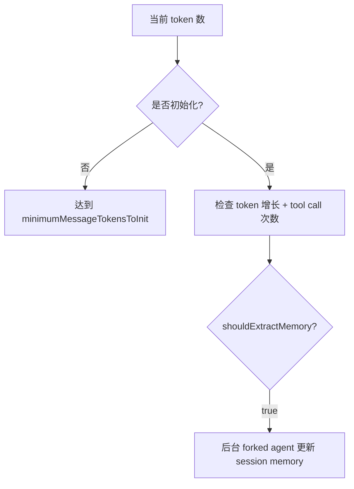
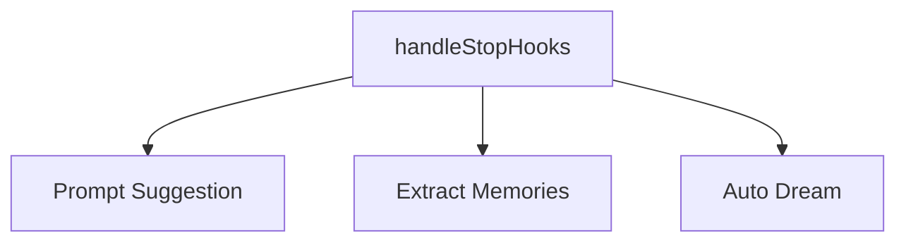
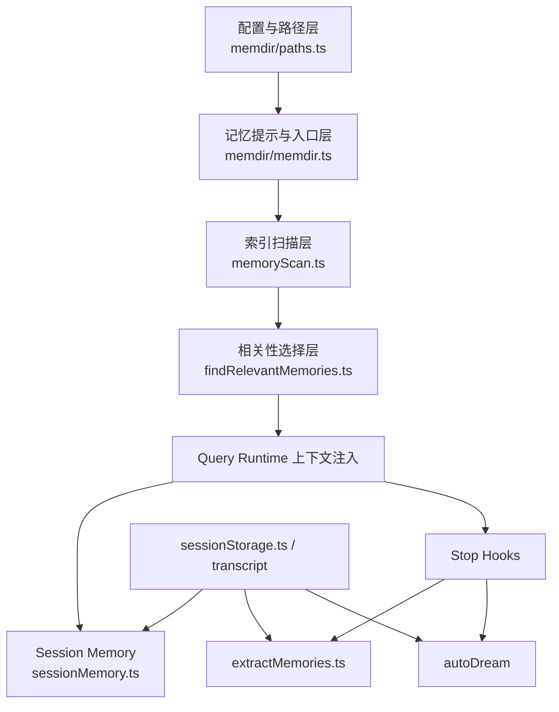

# 6. Memory 模块架构

Memory 相关能力是该仓最有层次感的子系统之一。它不是单一模块，而是由多个层次共同组成：

- `memdir/*`：持久记忆目录与记忆提示体系
- `services/SessionMemory/*`：当前会话的 session memory
- `services/extractMemories/*`：回合结束后的 durable memory 提取
- `services/autoDream/*`：长期后台整理能力
- `query/stopHooks.ts`：stop 阶段触发点

---

## 6.1 总体结构图

---

## 6.2 第一层：`memdir/*` 持久记忆目录系统

## 6.2.1 `memdir/memdir.ts`
这是 memory prompt 体系的中心文件，职责包括：

- 定义记忆入口文件 `MEMORY.md`
- 构建 memory prompt 指导文本
- 确保 memory directory 存在
- 控制 `MEMORY.md` 截断策略
- 组织 typed memory 的行为说明

### 关键常量
- `ENTRYPOINT_NAME = 'MEMORY.md'`
- `MAX_ENTRYPOINT_LINES = 200`
- `MAX_ENTRYPOINT_BYTES = 25_000`

### 核心函数与职责
- `truncateEntrypointContent(...)`：对 MEMORY.md 做双重截断（行数 + 字节）
- `ensureMemoryDirExists(...)`：确保 memory 目录存在
- `buildMemoryLines(...)`：生成面向模型的记忆规则文本

### 这一层的作用
这一层不是“存记忆内容”，而是：
- 定义记忆目录的行为约束
- 控制记忆如何进入系统提示词
- 规范 memory 文件的组织方式

---

## 6.2.2 `memdir/paths.ts`
该文件负责 memory 路径解析与功能门控。

### 它解决的问题
1. auto memory 是否启用
2. memory 根目录在哪里
3. 是否存在 override path
4. 如何从项目根得到稳定 memory 路径

### 重要逻辑
- `isAutoMemoryEnabled()`：按 env / remote / settings 决定是否启用
- `getMemoryBaseDir()`：决定 memory 根目录
- `getAutoMemPathOverride()`：处理 path override
- `getAutoMemPathSetting()`：处理 settings 中的 memory 目录
- `getAutoMemBase()`：使用 git root / project root 形成稳定 project memory 路径

### 架构意义
这层负责把 memory 从“一个硬编码目录”升级为：
- 环境敏感
- 配置敏感
- 项目敏感
- 远端模式兼容

的持久路径系统。

---

## 6.2.3 `memdir/memoryScan.ts`
这是 memory 索引扫描层。

### 职责
- 扫描 memory 目录中的 `.md` 文件
- 读取 frontmatter
- 形成 memory header 列表
- 格式化 memory manifest

### 主要输出
`MemoryHeader`：
- `filename`
- `filePath`
- `mtimeMs`
- `description`
- `type`

### 用途
- Query 时的相关记忆选择
- ExtractMemories 时把已有记忆注入给提炼 agent

这层相当于 memory 的“轻量索引层”。

---

## 6.2.4 `memdir/findRelevantMemories.ts`
这是 query 时的“相关记忆选择器”。

### 关键路径
1. 调 `scanMemoryFiles(memoryDir)`
2. 生成 manifest
3. 使用 `sideQuery(...)` 调模型选择相关 memory
4. 返回最相关的若干 memory 文件路径

### 特点
- 不是全量加载所有 memory 文件
- 先读 header，再由模型选择相关项
- 过滤已 surfaced 的条目
- 最近使用工具会影响选择逻辑

这一层是：
- 持久记忆系统的查询入口
- memory 不全量塞进上下文的关键优化点

---

## 6.3 第二层：Session Memory

Session Memory 不等同于持久 memory。它更像当前长会话的滚动摘要层。

## 6.3.1 `services/SessionMemory/sessionMemory.ts`
职责包括：

- 决定何时开始 session memory
- 创建 session memory 文件
- 周期性触发抽取
- 通过 forked subagent 在后台更新当前会话笔记

### 关键机制
- 达到初始化 token 阈值后才启用
- 工具调用数与 token 增量共同决定是否再次抽取
- 使用 `runForkedAgent(...)` 在后台更新 session memory
- 维护 `lastMemoryMessageUuid`

### 这一层的定位
它不是长期记忆，而是“当前会话的工作摘要层”。

---

## 6.3.2 `sessionMemoryUtils.ts`
这是 Session Memory 的状态与阈值工具层。

### 持有的状态
- `sessionMemoryConfig`
- `lastSummarizedMessageId`
- `extractionStartedAt`
- `tokensAtLastExtraction`
- `sessionMemoryInitialized`

### 提供的能力
- 配置阈值管理
- 是否达到初始化阈值
- 是否达到更新阈值
- 等待抽取完成
- 获取 session memory 内容

这一层把 session memory 从单个脚本逻辑拆成了稳定的状态机辅助层。

---

## 6.4 第三层：Durable Memory 提取

## 6.4.1 `services/extractMemories/extractMemories.ts`
这是 durable memory 提取层。

### 触发时机
在 `query/stopHooks.ts` 中，于一轮结束时 fire-and-forget 执行：
- 仅主线程
- 非 bare mode
- feature gate 与 auto-memory 开启

### 关键职责
- 判断最近消息中是否已经有主 agent 自己写入 memory
- 为提取 agent 构造受限 `canUseTool`
- 扫描现有 memory manifest
- 用 forked agent 从当前 transcript 中提炼 durable memory
- 仅允许在 auto memory 目录内进行 Edit/Write

### 一个关键设计点
`createAutoMemCanUseTool(memoryDir)` 明确限制提取 agent 的工具权限：
- `Read / Grep / Glob` 允许
- `Bash` 仅允许只读命令
- `Edit / Write` 仅允许在 auto memory 目录内

这说明 durable memory 提取是以“受限后台 agent”方式运行，而不是主线程直接写文件。

---

## 6.4.2 `query/stopHooks.ts` 中的接缝
Stop 阶段里：
- `executePromptSuggestion(...)`
- `executeExtractMemories(...)`
- `executeAutoDream(...)`

都在回合结束时被调度。

这使 stop 阶段成为 memory 平面的统一触发枢纽。

---

## 6.5 第四层：Session Storage 与 Transcript

`utils/sessionStorage.ts` 虽然不是 memory 目录代码，但对 memory 系统很关键。

### 作用
- 持有 transcript JSONL
- 提供 transcript path
- 支持 load / save / resume / fork
- 为 stop hooks 和 extract memories 提供对话来源

Memory 的许多动作并不是直接看当前 messages，而是通过：
- 当前消息流
- transcript
- memory manifest
- session memory file

共同完成。

---

## 6.6 Memory 模块内部的层次关系

---

## 6.7 Memory 子系统回答了哪些不同问题

| 子模块 | 回答的问题 |
|---|---|
| `memdir/paths.ts` | memory 放在哪、是否启用、目录如何稳定定位 |
| `memdir/memdir.ts` | memory 如何进入系统提示词、记忆格式如何规范 |
| `memoryScan.ts` | memory 文件如何被扫描与索引 |
| `findRelevantMemories.ts` | 当前 query 该取哪些 memory |
| `sessionMemory.ts` | 当前长会话如何维护滚动摘要 |
| `extractMemories.ts` | 回合结束后哪些内容应写入 durable memory |
| `sessionStorage.ts` | transcript 如何作为 memory 提炼的原始材料 |

---

## 6.8 小结

Memory 模块不是单点功能，而是一个完整平面：

- **持久记忆层**：`memdir/*`
- **会话摘要层**：`SessionMemory/*`
- **durable 提炼层**：`extractMemories/*`
- **stop 阶段收口层**：`query/stopHooks.ts`
- **transcript 底座**：`utils/sessionStorage.ts`

这套结构让系统同时具备：
- 长期偏好与项目记忆
- 当前长会话摘要
- 回合结束自动提炼
- 受限后台记忆写入

是整个仓库最值得重点分析的子系统之一。