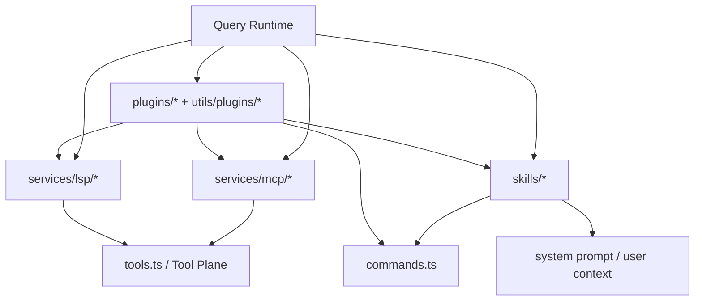
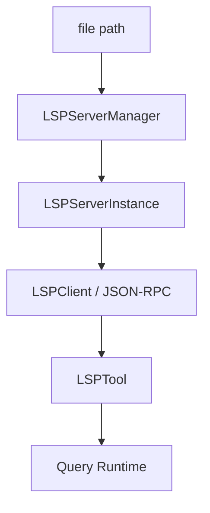
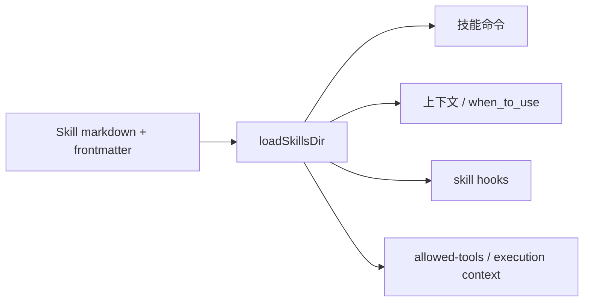
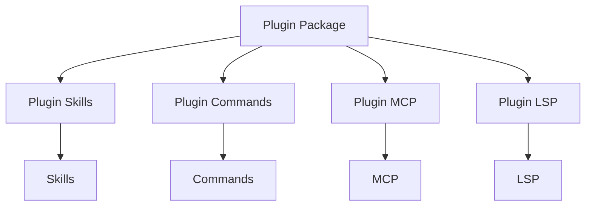

# 7. MCP / LSP / Skills / Plugins 扩展平面

这一章分析四类扩展面：

- MCP：外部工具 / 资源 / prompt 接入
- LSP：语义代码理解能力
- Skills：markdown/frontmatter 驱动的工作流与规则
- Plugins：更完整的打包型扩展

---

## 7.1 扩展平面总图

---

## 7.2 MCP 子系统

## 7.2.1 `services/mcp/client.ts`
这是整个 MCP 子系统的核心。

### 它负责的事情
- 管理 MCP transport：
  - stdio
  - SSE
  - streamable HTTP
  - websocket
  - SDK control transport
- 管理 auth 与 OAuth：
  - token refresh
  - 401 handling
  - auth cache
- 发现并包装：
  - tools
  - resources
  - prompts
- 处理 tool call output：
  - truncation
  - binary content persist
  - image resize/downsample
- 处理 MCP elicitation 与 hook 接缝

### 代码里的信号
`client.ts` 非常大，且直接导入：
- SDK transport
- auth helpers
- mcp output storage
- mcp validation
- websocket / proxy / mtls
- MCPTool / ReadMcpResourceTool / McpAuthTool

这说明 MCP 在系统中不是附属适配器，而是一级扩展总线。

---

## 7.2.2 MCP 与工具平面的连接方式

MCP 最终会转化为：
- MCP tool
- MCP resource listing / reading 工具
- MCP auth 工具

---

## 7.2.3 MCP 的架构角色

MCP 在这个系统中的角色可以概括为：
- 外部能力接入总线
- 工具与资源桥接层
- auth / transport / tool result 管理层

---

## 7.3 LSP 子系统

## 7.3.1 `services/lsp/LSPServerManager.ts`
这是 LSP 子系统的控制中心。

### 职责
- 加载全部 LSP server 配置
- 建立 extension → server 映射
- 创建 server instance
- 延迟启动 server
- 路由请求到正确的 server
- 维护 openedFiles 状态
- 处理 didOpen / didChange / didSave / didClose

### 设计风格
`createLSPServerManager()` 采用闭包式 factory，而不是 class：
- `servers: Map<string, LSPServerInstance>`
- `extensionMap: Map<string, string[]>`
- `openedFiles: Map<string, string>`

### 核心能力接口
- `initialize()`
- `shutdown()`
- `getServerForFile()`
- `ensureServerStarted()`
- `sendRequest()`
- `openFile()` / `changeFile()` / `saveFile()` / `closeFile()`

---

## 7.3.2 LSP 的架构位置

LSP 不只是一个工具，而是：
- 有独立 server manager
- 有独立 client / server instance / diagnostics registry
- 最终再通过 `LSPTool` 暴露为工具能力

这说明 LSP 在架构上更像“执行子系统”，而不是“单个工具实现文件”。

---

## 7.4 Skills 子系统

## 7.4.1 `skills/loadSkillsDir.ts`
该文件是 skills 系统的中心。

### 职责
- 计算 skills 目录路径
- 解析 markdown + frontmatter
- 解析 hooks、allowed-tools、effort、model、agent、shell 等 frontmatter 字段
- 按 project / user / policy / plugin / bundled / mcp 来源加载 skills
- 支持 argument substitution、path frontmatter、execution context

### 它暴露出的结构
- `getSkillsPath(...)`
- `estimateSkillFrontmatterTokens(...)`
- `parseHooksFromFrontmatter(...)`
- `parseSkillFrontmatterFields(...)`

这说明 skills 在这个系统中不只是 prompt 片段，而是正式的扩展描述单元。

---

## 7.4.2 Skills 在运行时中的作用

skills 可以影响：
- 命令控制面
- prompt 内容
- tool 允许集
- shell 执行上下文
- agent 选择
- hooks 配置

---

## 7.5 Plugins 子系统

## 7.5.1 Plugin 的位置
Plugin 比 skill 更重，通常由：
- `plugins/*`
- `utils/plugins/*`

承载。

### Plugin 系统负责
- 插件安装与缓存
- marketplace / bundled plugins
- plugin skills / commands / MCP / LSP 接入
- plugin error 管理与 refresh

### 与 skills 的区别
- skill 更像文件级扩展单元
- plugin 更像包级分发单元

---

## 7.5.2 Plugin 与其他扩展面的关系

插件系统本质上是：
- skills / commands / MCP / LSP 的高阶打包与分发层

---

## 7.6 四者之间的差异

| 扩展面 | 主要目标 | 运行时位置 |
|---|---|---|
| MCP | 接入外部工具 / 资源 / prompts | 外部能力接入总线 |
| LSP | 语义级代码理解 | 执行子系统 |
| Skills | 轻量工作流与上下文规则 | prompt / command / tool 约束层 |
| Plugins | 更重的打包与分发 | 扩展整合层 |

---

## 7.7 为什么这四类扩展面要并存

因为它们解决的是不同层次的问题：

- **MCP**：接入外部系统
- **LSP**：提升代码语义理解能力
- **Skills**：把经验、规则、工作流以低成本形式固化
- **Plugins**：把多个扩展能力打包成可分发资产

如果只看“都能扩展系统”，很容易混淆；但从职责上看，它们的边界是清楚的。

---

## 7.8 小结

扩展平面是该系统平台化能力的主要体现：

- `services/mcp/*` 负责对外系统接入
- `services/lsp/*` 负责语义代码理解基础设施
- `skills/*` 负责 markdown/frontmatter 驱动的轻量扩展
- `plugins/*` 负责更完整的打包型扩展

这些扩展不是零散外挂，而是与 Query Runtime、Tool Plane、Command Plane 深度耦合的正式子系统。