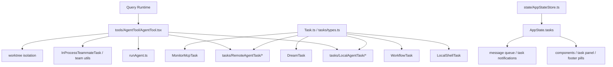
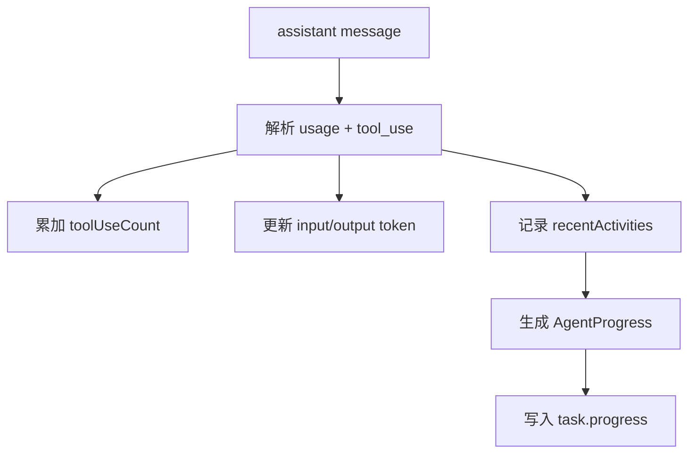
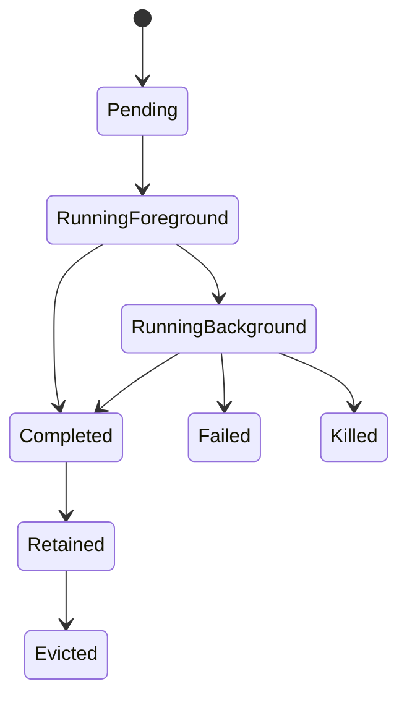
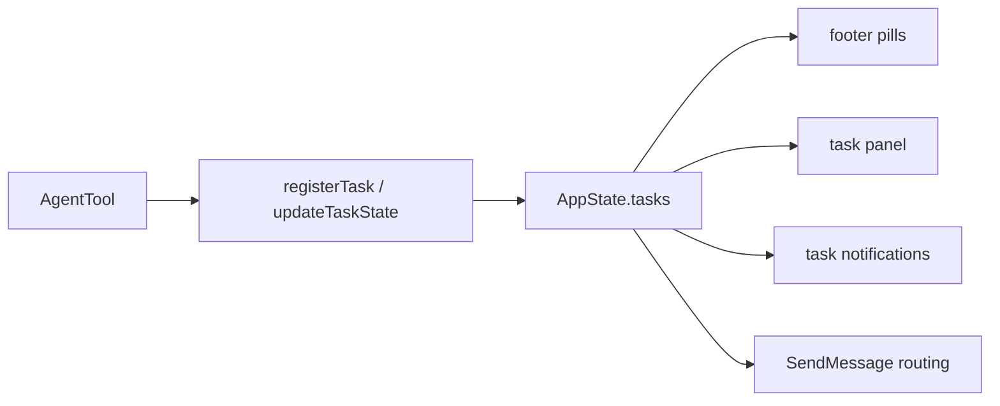
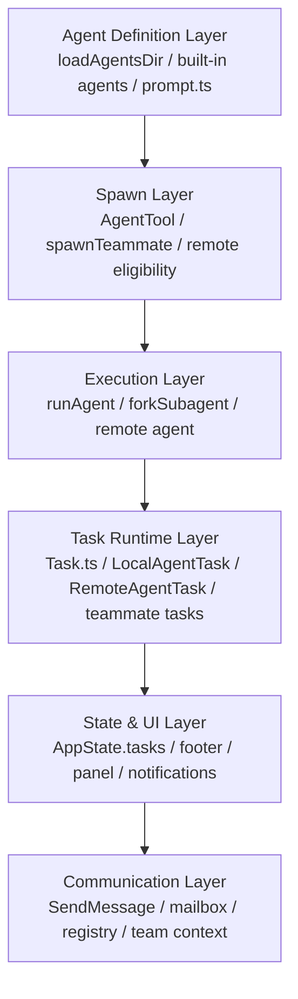

# 8. Agent / Task / Team 协作架构

这一章分析系统的多代理与任务层。这个仓的一个鲜明特点是：

- agent 不是“调用另一个 prompt”这么简单
- task 不是 UI 附件，而是正式运行时对象
- team / teammate 不是彩蛋，而是完整的协作语义

---

## 8.1 协作平面总图

---

## 8.2 `AgentTool`：多代理入口

## 8.2.1 `tools/AgentTool/AgentTool.tsx`
`AgentTool` 是协作平面的正门。

从 import 可以看出它并不是单点工具，而是汇集了大量协作子能力：

- `runAgent(...)`
- `spawnTeammate(...)`
- `registerAsyncAgent(...)`
- `registerRemoteAgentTask(...)`
- `createAgentWorktree(...)`
- `removeAgentWorktree(...)`
- `writeAgentMetadata(...)`
- `teleportToRemote(...)`
- `loadAgentsDir.ts`
- `prompt.ts`
- `agentMemory.ts`
- `AgentSummary`

这表明 `AgentTool` 实际上是一个协作 runtime adapter。

---

## 8.2.2 `AgentTool` 的输入维度

从 schema 可以看到它支持：
- `description`
- `prompt`
- `subagent_type`
- `model`
- `run_in_background`
- `name`
- `team_name`
- `mode`
- `isolation`
- `cwd`

这意味着 agent 调用不是单一“开一个子 agent”，而是要在多个维度上决策：
- 用哪个 agent 定义
- 前台还是后台
- 本地还是 remote
- 是否 worktree 隔离
- 是否加入 team
- 是否指定权限模式

---

## 8.2.3 `AgentTool` 的输出模式
输出模式至少有几类：
- `completed`
- `async_launched`
- `teammate_spawned`
- `remote_launched`

这意味着 AgentTool 不是同步 RPC，而是可能启动：
- 同步完成子任务
- 后台运行子 agent
- 团队成员实例
- 远端执行单元

---

## 8.3 `Task.ts`：任务抽象底座

`src/Task.ts` 定义了整个任务系统的基础抽象。

### `TaskType`
- `local_bash`
- `local_agent`
- `remote_agent`
- `in_process_teammate`
- `local_workflow`
- `monitor_mcp`
- `dream`

### `TaskStatus`
- `pending`
- `running`
- `completed`
- `failed`
- `killed`

### 基础结构 `TaskStateBase`
- `id`
- `type`
- `status`
- `description`
- `toolUseId`
- `startTime`
- `endTime`
- `outputFile`
- `outputOffset`
- `notified`

### 基础工厂
- `generateTaskId(type)`
- `createTaskStateBase(...)`

这说明任务系统不是“UI 里显示几个条目”，而是有严格的生命周期模型与统一主键系统。

---

## 8.4 `tasks/types.ts`：任务联合类型

`TaskState` 是多个具体任务状态的联合：
- `LocalShellTaskState`
- `LocalAgentTaskState`
- `RemoteAgentTaskState`
- `InProcessTeammateTaskState`
- `LocalWorkflowTaskState`
- `MonitorMcpTaskState`
- `DreamTaskState`

这意味着任务系统是一个多态容器，支持多种后台工作负载进入同一套注册、展示与通知机制。

---

## 8.5 `LocalAgentTask`：本地 agent 任务

## 8.5.1 `tasks/LocalAgentTask/LocalAgentTask.tsx`
这是本地 agent 任务的核心实现之一。

### 它关心的内容
- 进度跟踪
- 消息流拼接
- output file / transcript bootstrap
- background / foreground 状态
- retain / eviction 机制
- pendingMessages 队列
- UI notification
- progress summary

### `LocalAgentTaskState` 的关键字段
- `agentId`
- `prompt`
- `selectedAgent`
- `agentType`
- `model`
- `abortController`
- `result`
- `progress`
- `retrieved`
- `messages`
- `isBackgrounded`
- `pendingMessages`
- `retain`
- `diskLoaded`
- `evictAfter`

这说明一个本地 agent 任务至少同时维护：
1. 运行状态
2. 进度摘要
3. transcript / message 视图
4. 与 UI 面板的 retain 关系
5. 与磁盘 sidechain 的同步关系

---

## 8.5.2 Progress Tracker
`LocalAgentTask` 中专门定义了进度统计结构：
- `toolUseCount`
- `latestInputTokens`
- `cumulativeOutputTokens`
- `recentActivities`

并提供：
- `createProgressTracker()`
- `updateProgressFromMessage(...)`
- `getProgressUpdate(...)`
- `createActivityDescriptionResolver(...)`

这表明 agent 任务不是黑盒执行，而是可观测执行单元。

---

## 8.6 前台 / 后台 / 面板模型

从 `LocalAgentTaskState` 可以看出三套独立概念：

### 1. 是否后台化
- `isBackgrounded`

### 2. 是否被 UI 持有
- `retain`

### 3. 是否已从磁盘加载 transcript
- `diskLoaded`

这三个状态分离非常重要，因为它们分别回答：
- 任务是否在后台运行
- UI 是否需要保留它的完整视图
- 侧链 transcript 是否已进入内存

---

## 8.7 Team / Teammate 语义

从代码可以看到 team 相关能力分散在多个位置：
- `spawnTeammate(...)`
- `SendMessageTool`
- `TeamCreateTool`
- `TeamDeleteTool`
- `utils/teammate*.ts`
- `InProcessTeammateTask`

这说明 team 不是简单标签，而是有：
- teammate 生命周期
- mailbox / messaging
- foreground / viewing 语义
- name → AgentId registry
- team context

在 `AppState` 中也能看到：
- `agentNameRegistry`
- `expandedView: 'tasks' | 'teammates'`
- `viewSelectionMode`
- `viewingAgentTaskId`

---

## 8.8 AppState 中的任务注册表

`AppStateStore.ts` 里，任务相关状态明确进入全局应用状态：
- `tasks: { [taskId: string]: TaskState }`
- `foregroundedTaskId`
- `viewingAgentTaskId`
- `agentNameRegistry`

这意味着任务并不属于某个组件本地状态，而是运行时共享事实源。

---

## 8.9 远端与 worktree 隔离

`AgentTool` 支持：
- `isolation: worktree`
- remote agent eligibility / registration
- `teleportToRemote(...)`

### 这意味着 agent 执行可以被隔离在：
1. 本地当前工作目录
2. worktree 隔离副本
3. remote 环境

这是一个非常成熟的协作 runtime 能力，因为它把“子 agent 执行”从 prompt 逻辑扩展到了环境隔离层。

---

## 8.10 协作平面的层次划分

---

## 8.11 小结

协作平面是该仓区别于普通 CLI agent 的另一大核心特征：

- `AgentTool` 是多代理入口
- `Task.ts` 提供统一任务生命周期模型
- `LocalAgentTask / RemoteAgentTask / InProcessTeammateTask` 提供多态任务实现
- `AppState.tasks` 提供统一共享事实源
- `Team / Teammate / SendMessage` 提供真正的协作语义

从架构地位上说，Agent / Task / Team 已经是系统级能力，而不是“高级工具”。