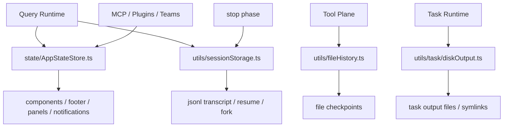
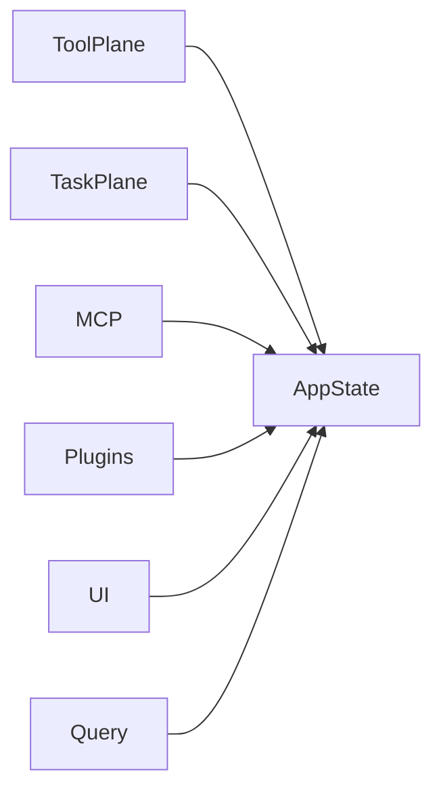
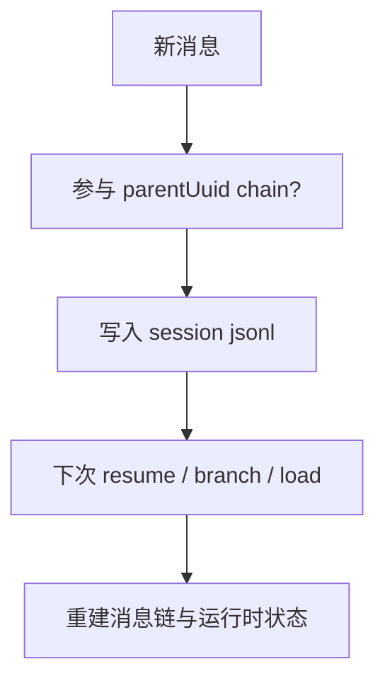
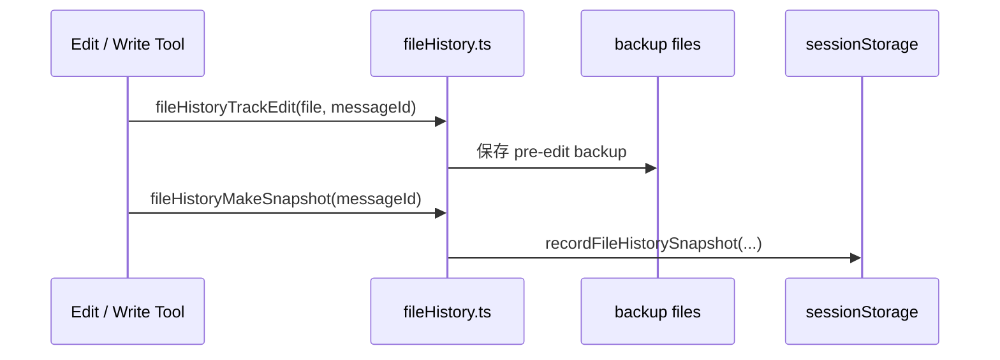
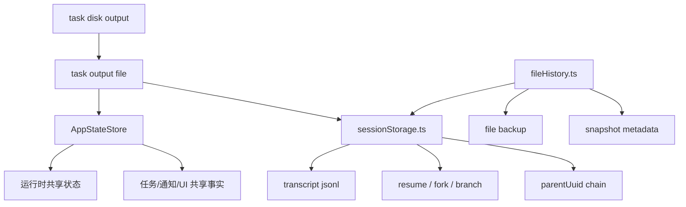

# 9. State / Session Storage / Persistence

如果说 Query Runtime 是心脏，那么状态与持久化层就是骨架和血管。

该仓的持久化并不只有“保存聊天记录”这么简单，而是同时承担：

- 会话 transcript
- resume / fork / load
- file history checkpoints
- task output sidechain
- app state 共享事实源
- attribution / todos / notifications / mcp / plugins 等运行时状态

---

## 9.1 全局结构图

---

## 9.2 `AppStateStore.ts`：运行时共享事实源

`AppStateStore.ts` 中的 `AppState` 非常庞大，这恰恰说明它是正式的共享状态容器。

### 它承载的主要维度

#### A. 产品与 UI 状态
- `verbose`
- `statusLineText`
- `expandedView`
- `footerSelection`
- `spinnerTip`
- `notifications`

#### B. 权限与模型状态
- `toolPermissionContext`
- `mainLoopModel`
- `mainLoopModelForSession`
- `thinkingEnabled`
- `promptSuggestionEnabled`

#### C. 任务与协作状态
- `tasks`
- `foregroundedTaskId`
- `viewingAgentTaskId`
- `agentNameRegistry`
- `remoteBackgroundTaskCount`

#### D. 扩展状态
- `mcp.clients / tools / commands / resources`
- `plugins.enabled / disabled / commands / errors`
- `agentDefinitions`
- `elicitation.queue`

#### E. 执行与历史状态
- `fileHistory`
- `attribution`
- `todos`
- `sessionHooks`

#### F. 特定 UI 子系统状态
- `tungsten*`（tmux）
- `bagel*`（browser）
- `computerUseMcpState`

这说明 `AppState` 不是“页面状态”，而是 runtime view-model + control-state 的集合。

---

## 9.3 为什么 `AppState` 如此庞大仍然合理

因为它承担的是多平面系统的**共享事实源**：
- task 注册表要被工具层、消息层、UI 层共用
- plugin / mcp / agent definitions 要被命令层和工具层共用
- notification / elicitation 要被外部事件与 UI 共用
- fileHistory / attribution / todos 要被工具调用与 stop 阶段共用

---

## 9.4 `utils/sessionStorage.ts`：会话 transcript 底座

这是整个持久化层最关键的底层文件之一。

### 关键职责
- 计算 project/session transcript 路径
- 定义 transcript message 与 parentUuid 链参与者
- 保存 / 加载 / 恢复 / tombstone / fork transcript
- 维护 `projects/` 目录层次
- 支撑 session resume、branch、worktree session

### 重要判断点
#### 1. `isTranscriptMessage(entry)`
明确 transcript 中哪些 entry 属于真正消息：
- user
- assistant
- attachment
- system

progress message 明确不算 transcript message。

#### 2. `isChainParticipant(m)`
决定哪些消息进入 parentUuid chain。

### 架构意义
这两个函数非常关键，因为它们决定：
- 哪些东西是持久化事实
- 哪些东西只是瞬时 UI 事件

---

## 9.5 Transcript 与会话恢复

`sessionStorage.ts` 反映出系统非常重视：
- 长会话恢复
- sidechain transcript 合并
- compact boundary
- resume 后 parentUuid 链正确性
- progress bridge 对旧 transcript 的兼容

这意味着 transcript 不是简单日志，而是会话恢复协议的一部分。

---

## 9.6 `fileHistory.ts`：文件检查点系统

这是另一个很有代表性的底层模块。

### 关键能力
- `fileHistoryTrackEdit(...)`
- `fileHistoryMakeSnapshot(...)`
- 记录 tracked files 与 snapshot sequence
- 对编辑前文件做 backup
- 把 snapshot 记录进 session storage

### `FileHistoryState`
- `snapshots`
- `trackedFiles`
- `snapshotSequence`

### 它实际提供的价值
1. turn 级文件检查点
2. 历史 diff 统计
3. 编辑前快照保全
4. 与 transcript 绑定的文件状态轨迹

这让系统具备了“对话 + 文件”双轨历史能力。

---

## 9.7 Task Output Sidechain

虽然具体实现散在 `utils/task/*`，但从任务代码里可以看出：
- 每个 task 有 `outputFile`
- 有 `outputOffset`
- 会进行 symlink 初始化与输出驱逐
- 背景任务完成后会生成 task notification，并附带 output path

这意味着后台任务有独立于主 transcript 的 side output 通道。

### 这种设计的价值
- 避免超长任务输出直接塞爆主对话
- 允许 UI / 后续工具按 offset 增量读取
- 给多任务提供统一磁盘落点

---

## 9.8 状态与持久化层内部关系

---

## 9.9 这一层为什么非常重要

很多人阅读这类仓库时，会把重点全部放在：
- 模型怎么调用
- tool 怎么执行

但真正让系统稳定可用的，往往是这层：
- transcript 正确性
- 任务与 UI 的共享状态
- 文件修改历史
- resume / compact / branch 后的一致性

这个仓在这些问题上明显投入很多设计精力。

---

## 9.10 小结

状态与持久化层主要由三部分组成：

1. `AppStateStore.ts`：共享事实源
2. `sessionStorage.ts`：会话 transcript 与恢复协议
3. `fileHistory.ts`：文件检查点与编辑历史

再加上 task output sidechain，共同把系统从“临时对话代理”提升为“可恢复、可审计、可协作的长期运行时”。