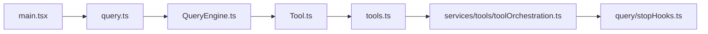
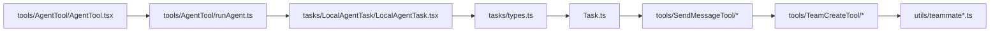
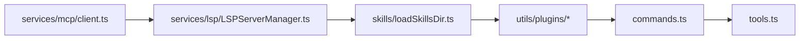
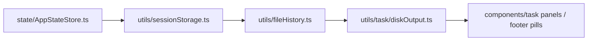

# 10. 关键文件与阅读入口索引

这一章不是重复前面内容，而是给出一份**真正可执行的阅读路线图**。

---

## 10.1 全仓最值得先看的根层文件

根据目录扫描，`src/` 根层关键文件如下：

- `main.tsx`
- `query.ts`
- `QueryEngine.ts`
- `Tool.ts`
- `tools.ts`
- `commands.ts`
- `Task.ts`
- `replLauncher.tsx`
- `interactiveHelpers.tsx`
- `dialogLaunchers.tsx`

其中优先级最高的是前 7 个。

---

## 10.2 推荐阅读路线 A：先抓全局

### 为什么这么读
- `main.tsx`：先知道系统怎么装配
- `query.ts`：知道主循环怎么跑
- `QueryEngine.ts`：知道 headless 路径如何复用
- `Tool.ts` / `tools.ts`：知道系统有哪些正式能力
- `toolOrchestration.ts`：知道多工具怎么调度
- `stopHooks.ts`：知道一轮结束后发生什么

---

## 10.3 推荐阅读路线 B：专看 Memory

### 这条线回答的问题
- memory 放哪
- memory 如何进入 prompt
- memory 如何扫描与选择
- session memory 如何滚动更新
- durable memory 如何在 stop 阶段提炼

---

## 10.4 推荐阅读路线 C：专看协作层

### 这条线回答的问题
- agent 如何被启动
- 子 agent 如何以 task 形式注册
- teammate / team 如何管理
- 为什么系统能支持多代理协作

---

## 10.5 推荐阅读路线 D：专看扩展平面

### 这条线回答的问题
- 外部能力如何进入系统
- 语义代码理解如何接入
- skill / plugin 如何影响命令与工具池

---

## 10.6 推荐阅读路线 E：专看状态与持久化

### 这条线回答的问题
- 共享状态在哪里
- transcript 怎么持久化
- 文件修改怎么 checkpoint
- 任务输出为什么不会直接污染主对话

---

## 10.7 关键文件作用速查表

| 文件 | 作用 |
|---|---|
| `src/main.tsx` | 全系统启动装配入口 |
| `src/query.ts` | 交互式 query 主循环 |
| `src/QueryEngine.ts` | headless / SDK 会话引擎 |
| `src/Tool.ts` | 工具协议与 ToolUseContext |
| `src/tools.ts` | 工具池装配 |
| `src/services/tools/toolOrchestration.ts` | 多工具串并发调度 |
| `src/query/stopHooks.ts` | stop 阶段治理与后台动作触发 |
| `src/memdir/memdir.ts` | memory prompt 与入口语义 |
| `src/memdir/memoryScan.ts` | memory 扫描与 manifest |
| `src/services/SessionMemory/sessionMemory.ts` | 会话级摘要记忆 |
| `src/services/extractMemories/extractMemories.ts` | durable memory 提炼 |
| `src/services/mcp/client.ts` | MCP 客户端与外部能力接入 |
| `src/services/lsp/LSPServerManager.ts` | LSP server 管理 |
| `src/skills/loadSkillsDir.ts` | skills 发现与 frontmatter 解析 |
| `src/tools/AgentTool/AgentTool.tsx` | 多代理入口 |
| `src/Task.ts` | 任务抽象与 task id 机制 |
| `src/tasks/LocalAgentTask/LocalAgentTask.tsx` | 本地 agent 任务运行时 |
| `src/state/AppStateStore.ts` | 全局共享状态源 |
| `src/utils/sessionStorage.ts` | transcript 与 resume/fork |
| `src/utils/fileHistory.ts` | 文件历史 checkpoint |

---

## 10.8 如果只看 10 个文件

如果时间有限，我建议直接看这 10 个：

1. `src/main.tsx`
2. `src/query.ts`
3. `src/QueryEngine.ts`
4. `src/Tool.ts`
5. `src/tools.ts`
6. `src/services/tools/toolOrchestration.ts`
7. `src/query/stopHooks.ts`
8. `src/memdir/memdir.ts`
9. `src/tools/AgentTool/AgentTool.tsx`
10. `src/utils/sessionStorage.ts`

这 10 个文件足以先建立整个系统的骨架理解。

---

## 10.9 小结

这一章的目的只有一个：
让后续读源码的人，不至于一头扎进 2000+ 文件里乱转。

最优先的不是“每个文件都看”，而是先抓：
- 启动装配
- query runtime
- tool plane
- stop hooks
- memory
- agent/task
- state/persistence

抓住这几条主线，后续再下钻细节会顺很多。