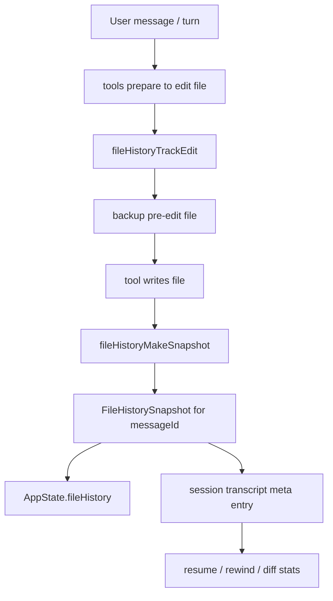
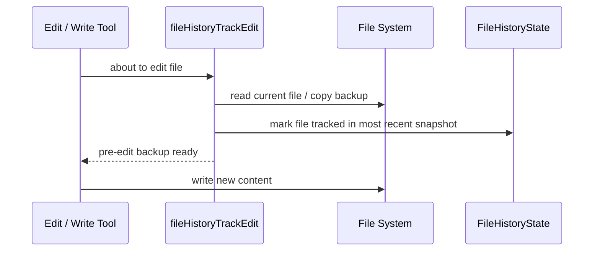
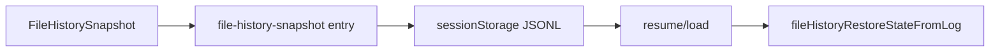
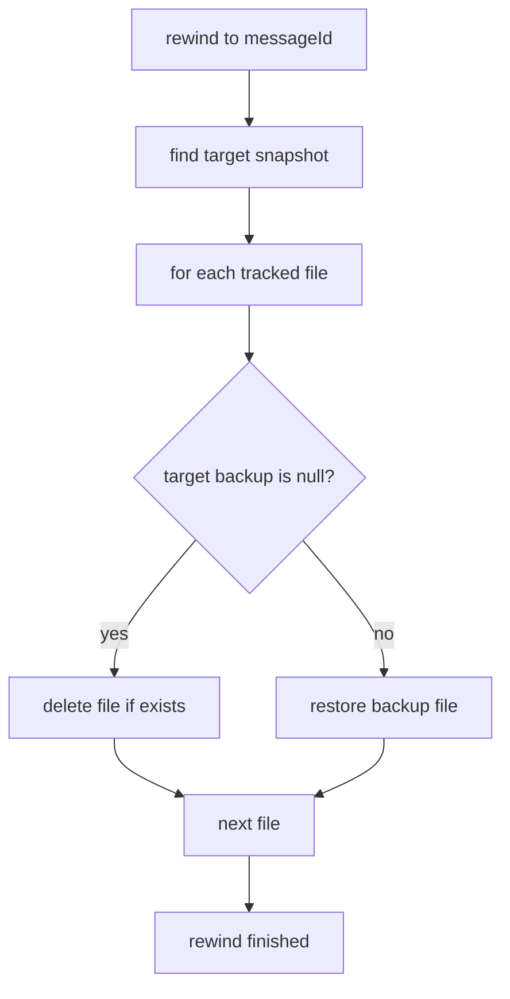

# 11. 文件快照 / File History 机制

这一章专门分析 Claude Code 源码里的**文件快照（file history / file checkpointing）**机制。

先给结论：

> 这不是 Git，也不是整个工作区镜像快照，而是一套**按消息锚点建立的文件检查点系统**：改文件前先备份，按消息生成快照，必要时支持 rewind / restore / resume。

---

## 11.1 它到底是什么

File History 解决的是这样一个问题：

- agent 改了文件
- 用户想回到某条消息对应的文件状态
- 会话中断后，希望恢复文件检查点能力
- UI / CLI 需要先告诉用户“回滚会改哪些文件”

它并不试图替代 Git，而是补上**会话内、消息级、自动化回退**这一层。



---

## 11.2 核心文件

主要实现点：

- `src/utils/fileHistory.ts`
- `src/utils/sessionStorage.ts`
- `src/tools/FileEditTool/FileEditTool.ts`
- `src/tools/FileWriteTool/FileWriteTool.ts`
- `src/tools/NotebookEditTool/NotebookEditTool.ts`
- `src/tools/BashTool/BashTool.tsx`
- `src/components/MessageSelector.tsx`
- `src/screens/REPL.tsx`
- `src/cli/print.ts`

---

## 11.3 核心数据结构

## 11.3.1 单文件备份

```ts
export type FileHistoryBackup = {
  backupFileName: string | null
  version: number
  backupTime: Date
}
```

这里最关键的是：
- `backupFileName: null` 表示**这个版本下文件不存在**

也就是说，系统可以表达：
- 文件存在且有备份版本
- 文件在当时根本不存在

---

## 11.3.2 按消息的快照

```ts
export type FileHistorySnapshot = {
  messageId: UUID
  trackedFileBackups: Record<string, FileHistoryBackup>
  timestamp: Date
}
```

这表示：
- 某条 `messageId`
- 对应一组被跟踪文件的版本映射

换句话说，File History 的锚点不是“时间戳”，而是**消息 UUID**。

---

## 11.3.3 全局状态

```ts
export type FileHistoryState = {
  snapshots: FileHistorySnapshot[]
  trackedFiles: Set<string>
  snapshotSequence: number
}
```

含义：
- `snapshots`：已有的文件快照链
- `trackedFiles`：当前被跟踪过的文件集合
- `snapshotSequence`：快照序号，用于活动信号 / UI / 恢复场景

---

## 11.4 什么时候开始记录

File History 不是在回合结束后突然“全局扫一遍文件系统”，而是分成两个动作。

## A. 改文件前：`fileHistoryTrackEdit(...)`

这个函数会在真正改文件前调用。源码里可以在这些工具里看到：

- `FileEditTool`
- `FileWriteTool`
- `NotebookEditTool`
- `BashTool`

### 语义
> 在文件被写入前，先保存当前版本的备份。

### 关键点
- 必须在 edit / write **之前**调用
- 避免把“修改后的内容”错误地当成备份版本
- 对新文件用 `backupFileName: null` 表示“之前不存在”



---

## B. 按消息形成快照：`fileHistoryMakeSnapshot(...)`

这个函数会在消息/回合边界被调用，主要出现在：

- `utils/handlePromptSubmit.ts`
- `QueryEngine.ts`
- `screens/REPL.tsx`

### 语义
> 为某个 `messageId` 生成一个文件状态快照点。

### 它会做什么
- 遍历所有 `trackedFiles`
- 判断文件是否变化
- 变化则创建新 backup 版本
- 未变化则复用旧版本
- 缺失文件记录为 `null`
- 生成一个新的 `FileHistorySnapshot`

```mermaid
flowchart TD
    A[fileHistoryMakeSnapshot(messageId)] --> B[iterate trackedFiles]
    B --> C{file exists?}
    C -->|no| D[record null backup]
    C -->|yes| E{changed since latest backup?}
    E -->|no| F[reuse latest backup]
    E -->|yes| G[create new backup version]
    D --> H[assemble FileHistorySnapshot]
    F --> H
    G --> H
    H --> I[append to snapshots]
    I --> J[record snapshot to sessionStorage]
```

---

## 11.5 备份文件存在哪里

`fileHistory.ts` 里备份文件路径是：

```text
{configDir}/file-history/{sessionId}/{backupFileName}
```

备份文件名不是原始文件名，而是：

```text
sha256(filePath).slice(0,16) + @v{version}
```

例如：

```text
abc123def4567890@v1
abc123def4567890@v2
```

### 这样设计的好处
- 路径稳定
- 不直接暴露原始文件名
- 同路径的不同版本自然递增
- 存储结构规整

---

## 11.6 它如何接入 session transcript

这块很关键。File History 不只是内存态，它会写进会话日志。

在 `types/logs.ts` 里：

```ts
export type FileHistorySnapshotMessage = {
  type: 'file-history-snapshot'
  messageId: UUID
  snapshot: FileHistorySnapshot
  isSnapshotUpdate: boolean
}
```

在 `sessionStorage.ts` 里会通过：

- `recordFileHistorySnapshot(...)`
- `insertFileHistorySnapshot(...)`

把快照写进 transcript / meta log。



### 这意味着
File History 和普通对话消息一样，挂在同一套会话持久化底座上。

---

## 11.7 Resume 时怎么恢复

相关函数：
- `fileHistoryRestoreStateFromLog(...)`
- `copyFileHistoryForResume(...)`

## 11.7.1 恢复内存态
`fileHistoryRestoreStateFromLog(...)` 会从 log 中恢复：
- `snapshots`
- `trackedFiles`
- `snapshotSequence`

## 11.7.2 复制/硬链旧会话备份文件
`copyFileHistoryForResume(...)` 会把旧 session 的 backup 文件：
- hard link 到新 session 的 file-history 目录
- 如果 hard link 不行就 fallback copy

### 含义
> resume 后并不是只恢复一个“快照索引”，连底层 backup 文件也会跟着迁移。

---

## 11.8 Rewind / Restore 是怎么做的

核心函数：
- `fileHistoryCanRestore(...)`
- `fileHistoryGetDiffStats(...)`
- `fileHistoryHasAnyChanges(...)`
- `fileHistoryRewind(...)`

## 11.8.1 先看能不能回滚
`fileHistoryCanRestore(...)` 只是检查某条消息是否有对应 snapshot。

## 11.8.2 Dry-run：先算会改哪些文件
`fileHistoryGetDiffStats(...)` 会：
- 计算 `filesChanged`
- 计算 `insertions`
- 计算 `deletions`

这就是 UI/CLI 在真正回滚前告诉用户：
- 会影响哪些文件
- 改动量多大

## 11.8.3 真回滚：`fileHistoryRewind(...)`
逻辑是：
- 找到目标 `messageId` 对应的 snapshot
- 对每个 tracked file：
  - 若目标版本是 `null` → 删除文件
  - 若目标版本有 backup → restore backup



---

## 11.9 UI / CLI 上层怎么用这套能力

## UI 路径
- `components/MessageSelector.tsx`
- `screens/REPL.tsx`

典型流程：
1. 用户选一条旧消息
2. 系统调用 `fileHistoryCanRestore`
3. 先 `fileHistoryGetDiffStats`
4. 用户确认
5. 调 `fileHistoryRewind`

## CLI 路径
- `cli/print.ts`

也有同样逻辑：
- dry-run
- 显示影响
- 真 rewind

这说明 File History 是**正式能力**，不是内部调试残留。

---

## 11.10 它和 Git 的关系

这个功能不是 Git 替代品。

### Git 负责
- 分支
- commit
- merge
- review
- 长期版本控制

### File History 负责
- 会话内自动 checkpoint
- 按消息锚点回退
- 不依赖手工 commit
- 对未纳入 Git 的文件也可能有效

所以它更像：
> Agent Runtime 级别的文件恢复层

---

## 11.11 它和其他状态机制的关系

### 和 `readFileState` 的关系
- `readFileState`：防 stale write / 写一致性
- `fileHistory`：防改坏后无法回退

### 和 `sessionStorage` 的关系
- File History 的快照链会被写入 transcript meta
- Resume 会从 transcript 重建 File History 状态

### 和模型上下文管理的关系
- File History 不直接注入模型
- 它主要用于 rewind / restore / resume
- 它属于**runtime state / persistence layer**，不是 prompt context layer

---

## 11.12 设计价值

这一机制让 Claude Code 从：
- “能改文件的 agent”

变成：
- “能按消息点恢复文件状态的 agent runtime”

这对用户心智非常重要，因为用户最怕：
- agent 改坏代码
- 想退回去却没有明确锚点

而 File History 提供的就是：
- 自动记录
- 消息级锚点
- 可预览回滚影响
- 可在 resume 后延续

---

## 11.13 最终结论

Claude Code 的文件快照机制本质上是：

> **改文件前做备份、按消息生成快照、把快照写进会话日志、并支持基于消息的 diff / rewind / resume 恢复的一套文件检查点系统。**

它不是 Git，也不是整仓镜像，而是一个很典型的 Agent Runtime 级恢复能力。