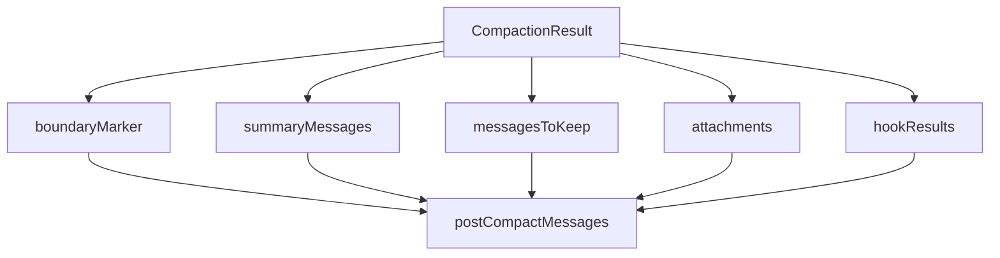
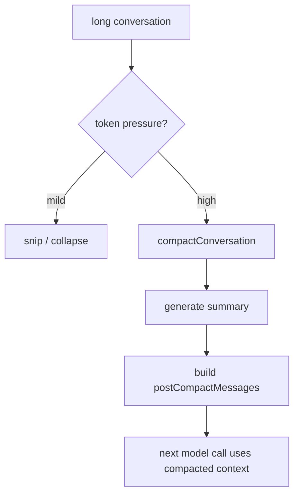
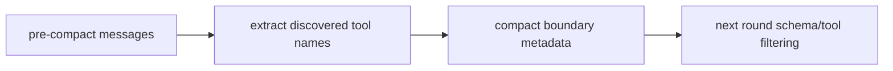
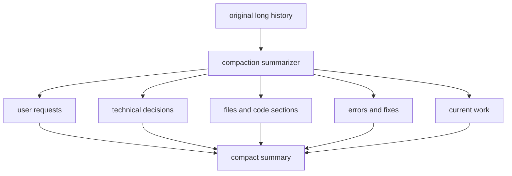
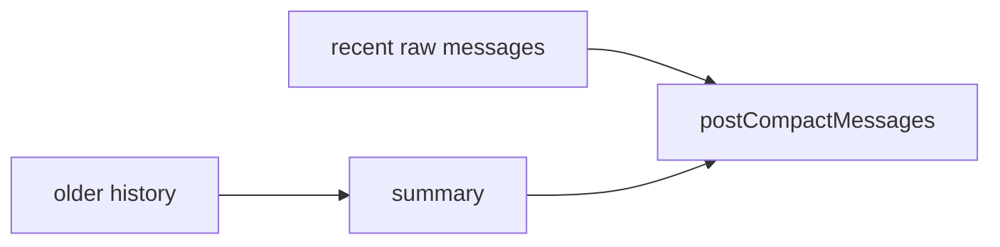
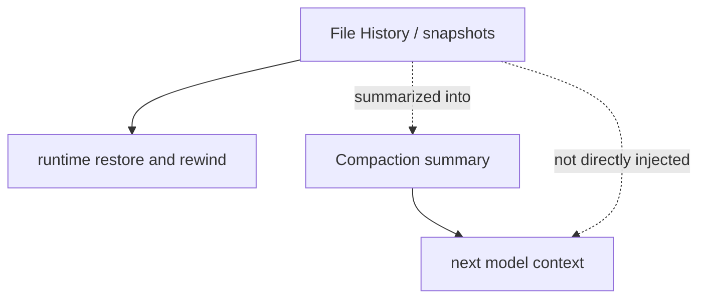
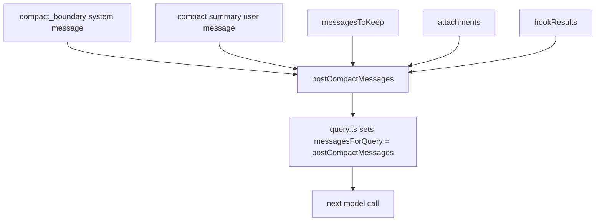

# 12. 压缩机制与压缩后注入上下文

这一章专门回答三个问题：

1. Claude Code 为什么要做会话压缩
2. 压缩后到底往下一轮上下文里注入了什么
3. 这些内容和 file history / transcript / resume 分别是什么关系

先给结论：

> 压缩后，Claude Code **不会**把完整旧历史或 file history 快照原样继续喂给模型；它会构造一组新的 **post-compact messages**，其中核心是：`compact_boundary + compact summary + 可能保留的最近原始消息 + attachments + hook results`。

---

## 12.1 压缩结果的骨架

在 `services/compact/compact.ts` 里，压缩后的消息数组是这样组装的：

```ts
buildPostCompactMessages(result)
```

源码注释直接写了顺序：

> Order: boundaryMarker, summaryMessages, messagesToKeep, attachments, hookResults

也就是：



然后在 `query.ts` 里：

```ts
const postCompactMessages = buildPostCompactMessages(compactionResult)
messagesForQuery = postCompactMessages
toolUseContext.messages = messagesForQuery
```

### 这意味着
> 下一轮真正进入模型上下文的，不是原始长历史，而是这组 post-compact messages。

---

## 12.2 为什么要压缩

Claude Code 的长上下文治理是分层的：
- `snipCompact`
- `autoCompact`
- `contextCollapse`
- `reactiveCompact`

其中 `compactConversation(...)` 是比较正式的“生成摘要并重建上下文”路径。



压缩的目标不是“把上下文删掉”，而是：
- 保住延续工作所需的语义骨架
- 丢掉高 token 成本的原始历史
- 在需要时仍可通过 transcript 再读精确细节

---

## 12.3 注入内容 1：`compact_boundary`

来自：
- `utils/messages.ts`
- `createCompactBoundaryMessage(...)`

这是一个 system message：
- `type: 'system'`
- `subtype: 'compact_boundary'`
- `content: 'Conversation compacted'`

### 它带的 metadata
最常见包括：
- `trigger`
- `preTokens`
- `userContext`
- `messagesSummarized`

此外，在 compact 阶段还会额外注入：
- `preCompactDiscoveredTools`

### `preCompactDiscoveredTools` 的意义
源码注释非常明确：
- summary 不会保留 `tool_reference` blocks
- 所以 boundary metadata 要额外带上已发现工具状态

也就是说，压缩后不仅保住“文字总结”，还保住一部分**工具发现上下文**。



---

## 12.4 注入内容 2：`compact summary` 用户消息

这才是压缩后最核心的上下文注入项。

在 `compact.ts` 里会构造：

```ts
createUserMessage({
  content: getCompactUserSummaryMessage(...),
  isCompactSummary: true,
  isVisibleInTranscriptOnly: true,
})
```

### 关键点
- 它是一个 **user message**
- 它是合成出来的 compact summary
- 它不是原始用户输入，也不是 assistant 输出

---

## 12.5 summary 本身怎么清洗

`getCompactUserSummaryMessage(...)` 会先调用：

```ts
formatCompactSummary(summary)
```

它会：
1. 去掉 `<analysis>...</analysis>`
2. 提取 `<summary>...</summary>`
3. 把 summary 内容格式化成可读文本

### 含义
压缩模型生成时可能会带：
- draft analysis
- structured summary XML

但真正注入回主会话上下文的，是：
> **去掉 analysis 草稿后的正式 summary 内容**

---

## 12.6 summary 里到底要求保留什么

`services/compact/prompt.ts` 里要求 compact summary 包含这些维度：

- 用户主要请求
- 技术概念 / 决策
- 错误与修复
- 当前工作状态
- 下一步
- **Files and Code Sections**

其中最关键的是：

> Enumerate specific files and code sections examined, modified, or created.

也就是说，压缩后模型拿到的并不是：
- 原始 file history 快照链

而是：
- **文件和代码段的摘要表示**



---

## 12.7 注入内容 3：transcript path 提示

如果有 transcript path，summary message 里会额外加入一段：

> If you need specific details from before compaction ... read the full transcript at: {transcriptPath}

### 这意味着什么
Claude Code 不是试图把所有细节都塞进 summary。

它采用的是一种分层策略：
- **summary**：保语义骨架
- **transcript path**：保精确细节的按需回读入口

### transcript path 是什么
就是：
> 当前会话完整 transcript 日志文件在本地磁盘上的路径

这不是逻辑 ID，而是真实文件路径。

---

## 12.8 注入内容 4：continuation instruction

如果 `suppressFollowUpQuestions` 为真，summary message 里还会额外加入 continuation 指令，大意是：

- 直接从断点继续
- 不要承认 summary 的存在
- 不要 recap
- 不要重新问用户该做什么

如果是 proactive/autonomous 模式，还会再加一层：
- 你本来就在自动工作
- 继续工作循环
- 不要重新打招呼

### 这块的本质
压缩后恢复的不只是“知识”，还有：
> **继续执行的行为语义**

---

## 12.9 注入内容 5：保留的原始消息 `messagesToKeep`

压缩后不一定是“只留 summary”。

`buildPostCompactMessages(result)` 里明确有：

```ts
...(result.messagesToKeep ?? [])
```

这表示某些压缩路径会：
- 总结旧历史
- 但保留最近一段原始消息不动

这类模式的意义是：
- 让模型保留最近对话细节
- 同时用 summary 承接更早部分历史

### `sessionMemoryCompact` 更明显
在 `sessionMemoryCompact.ts` 里，构造 summary 时会传：

```ts
getCompactUserSummaryMessage(..., true, transcriptPath, true)
```

这里最后一个参数 `recentMessagesPreserved = true`，会让 summary 多一句：

> Recent messages are preserved verbatim.

所以有些压缩路径明确是：
> **summary + 最近原文共存**



---

## 12.10 注入内容 6：attachments 与 hook results

压缩结果还会带：
- `attachments`
- `hookResults`

也就是说，post-compact context 不是只有 summary 和 boundary。

### attachment 来源
可能来自：
- post-compact file attachments
- session-memory compact 附加内容
- 某些辅助性上下文材料

### hookResults 来源
来自 post-compact hooks 产生的额外消息。

---

## 12.11 压缩后**不会**注入什么

这点必须说清楚。

## 不会直接注入 file history snapshots
压缩后不会把这些东西原样喂给模型：
- `trackedFileBackups`
- `backup v1/v2/v3`
- `file-history-snapshot` meta entries
- rewind metadata

这些属于：
> runtime / persistence / restore 层

不是：
> 主模型上下文层

---

## 12.12 file history 和 compaction 的真实关系

### File History 会继续存在于 runtime 层
会话压缩后，runtime 侧依然可能保留：
- `fileHistorySnapshots`
- rewind 能力
- resume 时的 file history 恢复

相关函数：
- `fileHistoryRestoreStateFromLog(...)`
- `copyFileHistoryForResume(...)`
- `fileHistoryRewind(...)`

### 但它不会原样注入模型
模型拿到的是：
- 文件/代码段摘要
- transcript path 提示

不是文件版本链本身。



---

## 12.13 压缩后上下文的源码级结构

把前面所有点合起来，post-compact context 大致就是：



### 可以直接下的源码级判断
1. 压缩后上下文不是“删掉旧历史然后随便总结一下”
2. 它是一个正式构造的新消息数组
3. summary 是核心，但不是唯一内容
4. transcript path 是按需回读原始细节的后门
5. file history 不进入模型，但继续留在 runtime

---

## 12.14 `compact_boundary` 的另一层意义：恢复边界

压缩不仅影响下一轮模型上下文，还影响：
- transcript 链接
- resume 时链重建
- 某些 preserved segment 的 relink 逻辑

所以 `compact_boundary` 既是：
- 模型上下文的边界标记
也是：
- 会话持久化 / 恢复语义的边界标记

---

## 12.15 最终结论

Claude Code 压缩后，真正注入给模型的是：

1. `compact_boundary` system message
2. 清洗后的 `compact summary` user message
3. 可选的 `messagesToKeep`
4. attachments
5. post-compact hook results
6. summary 内部附带的 transcript path 提示
7. continuation / proactive continuation 指令
8. compact metadata 中的少量状态（如 `preCompactDiscoveredTools`）

**不会直接注入的内容：**
- file history snapshots
- 原始文件版本链
- rewind 元数据

所以最准确的一句话是：

> **Claude Code 的压缩机制是“用结构化 summary + 少量状态元数据 + 可选保留原文”重建下一轮上下文，而不是把旧历史或文件快照原样塞回模型。**